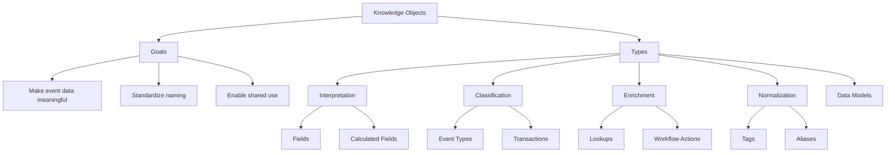

---

> [!note]  
> This guide provides a practical and comprehensive explanation of Splunk's components and how they're used in real-world scenarios—from ingesting logs to building dashboards and automating alerts.

# What is Splunk Index

The **Index** is the core of Splunk’s data storage system. It holds all incoming data, structured as individual events. Here's how the indexing process works:

1. **Data Entry**: Raw data is ingested from various sources like logs, syslog servers, APIs, or file uploads.
2. **Sourcetyping**: Splunk assigns a **sourcetype** to categorize data by structure and format. This helps in parsing and querying later.
3. **Event Breaking**: Data is split into individual events. For example, each log line becomes an event.
4. **Timestamp Normalization**: Dates are converted into a consistent format to support time-based searching.
5. **Indexing**: Events are stored with metadata for fast retrieval.

> [!example]  
> If you're monitoring Apache logs, Splunk will categorize entries as `sourcetype=access_combined` and store them for time-series analysis.

# Search Language (SPL)

Splunk uses **Search Processing Language (SPL)** to retrieve and analyze data.

Use cases:

- Find all failed login attempts  
- Count number of events from a specific host
- Track error rate over time

Common features:

- **Wildcards**: `error*` matches `error`, `errors`, etc.
- **Logical Operators**: `AND`, `OR`, `NOT` to refine results
- **Quotes**: Use `"exact phrase"` for precise matches
- **Escape Characters**: `\` to include special characters

---
## Search Mechanics

Searching in Splunk involves defining:

- **Search Terms** (e.g., `index=firewall`)
- **Commands** (e.g., `stats`)
- **Functions** (e.g., `count`, `avg`)
- **Arguments** (e.g., `(bytes)`)
- **Clauses** (e.g., `as total_bytes`)

> [!example]  
> `index=web sourcetype=access_combined status=500 | stats count by uri` helps identify pages causing errors.

---
# Reports and Dashboards

Reports are saved searches that return data in a readable format, often on a schedule. Dashboards are visual collections of such reports.

> [!tip]  
> Use dashboards to monitor metrics like website traffic or application errors in real time.

## Reports

Reports are persistent search results. Benefits:
- Schedule automatic runs
- Share with teams
- Use in dashboards

### Scheduling

- Changes report to run as the owner
- Removes the time picker
- Allows alert-style actions like email or logging

> [!example]  
> Weekly security report for failed SSH logins, emailed every Monday at 6:00 AM.

---
## Dashboards

Visual tools to monitor key metrics. Built by:

1. Running a search
2. Clicking **Visualization**
3. Saving as a new or existing dashboard
4. Adding and editing panels

### Dashboard Studio

Advanced dashboard editor with two modes:
### Layout Modes

|Feature|Absolute Mode|Grid Mode|
|---|---|---|
|Custom Canvas Size|✅|Limited|
|Shapes, Icons, Images|✅|❌|
|Visualizations|Unlimited|Width-constrained|

> [!warning]  
> Converting a dashboard may result in format loss. Always clone before editing.

### Edit Mode

- Interactive editor for arranging panels
- Supports drag-and-drop and property editing

---
## Alerts

**Alerts** notify you when specific conditions occur, such as system failures or security breaches. You can:

- Send emails
- Trigger scripts
- Push data to other systems

> [!example]  
> Set an alert for more than 5 failed SSH attempts in 10 minutes to detect brute-force attacks.

---
## Splunk Web Interface

### Roles

Permissions vary by role:

### Splunk Enterprise

- **Admin**: Full control over configuration and data
- **Power**: Can create alerts, reports, and dashboards
- **User**: Limited to search and view data

### Splunk Cloud

- Includes additional roles like `can_delete` and `token_auth` for cloud-specific tasks.

### Apps

Apps extend Splunk’s capabilities:

- **Search & Reporting**: Default app for querying data
- **Splunkbase**: Community marketplace for prebuilt apps like Cisco Security Suite or AWS CloudTrail

---
# Knowledge Objects

## Data Models

**Data Models** structure raw data into reusable datasets. They're essential for:

- Speeding up complex queries
- Creating pivot tables without SPL
- Powering dashboard panels and reports

> [!example]  
> A data model for firewall logs might include fields like `src_ip`, `dest_ip`, `action`, making it easier to build security analytics.

---

> Knowledge Objects in Splunk are reusable configurations that enhance search efficiency, data consistency, and collaboration across teams.

## Goals

- **Meaning**: Add structure and semantic clarity to raw event data
- **Consistency**: Standardize naming and data interpretation
- **Reusability**: Shareable across users, apps, and dashboards

## Types of Knowledge Objects

| **Category**     | **Elements**                        | **Purpose**                                                  |
|------------------|-------------------------------------|--------------------------------------------------------------|
| Interpretation   | Fields, Calculated Fields           | Extract and compute meaningful attributes                    |
| Classification   | Event Types, Transactions           | Categorize and correlate related events                      |
| Enrichment       | Lookups, Workflow Actions           | Augment data with external context and user-driven actions   |
| Normalization    | Tags, Aliases                       | Harmonize labels and field names for unified access          |
| Data Modeling    | Data Models                         | Create structured, hierarchical datasets for reporting       |

> [!tip]
> Knowledge Objects fuel dashboards, alerts, and reports—use them to reduce redundancy and simplify your SPL workflows.

---
Penguinified by [https://chatgpt.com/g/g-683f4d44a4b881919df0a7714238daae-penguinify](https://chatgpt.com/g/g-683f4d44a4b881919df0a7714238daae-penguinify)
