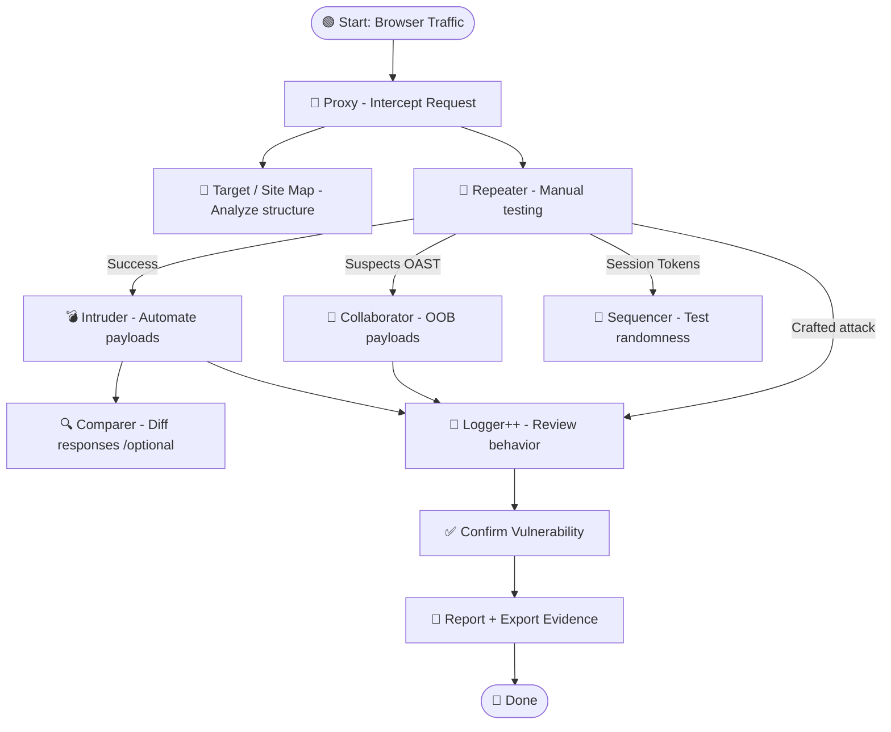

# 🧰 Burp Suite: Feature Breakdown 

Burp Suite remains the go-to toolkit for web application security testing. Here's a complete breakdown of each built-in tool, how it's used in real-world scenarios, and what modern alternatives exist in 2025.

---

## 🧿 Proxy (Core)

**Purpose:** Intercepts HTTP/S requests between browser and target.

✅ **Always keep using this** — it’s the heart of Burp.

**Example:**
- Intercept login POST request
- Modify parameters or headers before forwarding
- Save to Repeater/Intruder for deeper testing

---

## 🔓 Decoder

**Purpose:** Encode/decode data (Base64, URL, HTML, JWT, etc.)
- Great for quick transformations
- Supports hashing, smart decode guessing

**Example:**

```bash
ZGF0YT1zZWNyZXQ= → data=secret
```

### 🔁 2025 Power Tool:

**[[Cyberchef]]** – powerful, browser-based, recipe-based transformer.

---

## 🧬 Comparer

**Purpose:** Diff raw requests/responses to spot subtle differences.
**Example:** Compare failed login vs. valid login response.

### 🔁 2025 Alternatives:

|Tool|Notes|
|---|---|
|`diff` / `meld`|CLI and GUI diff|
|Notepad++ Compare Plugin|Fast GUI diff on Windows|
|`Beyond Compare`|Commercial option|

---

## 📓 Logger / Logger++

**Purpose:** View every request and response across Burp.

- Filters by URL, status, method, etc.
- Logger++ (BApp) adds tags, search, export

### 🔁 Alternative:

- Browser DevTools (for basic traffic)
- Custom logging via `mitmproxy` or `ZAP`

✅ Still useful inside Burp during large sessions or multi-step workflows.

---

## 🧠 Target / Site Map

**Purpose:** Map the structure of the application.
- Auto-built from traffic
- Useful for recon, scanning, and visualizing URL structure
**Example:** Expand paths like `/admin/`, `/login`, `/api/user/:id`.

📌 No direct replacement needed. Use alongside `ffuf` or `gau`.

---

## 🧩 Extender / BApp Store

**Purpose:** Customize Burp with scripts and plugins.
- Load Python (via Jython), Java, or BApp store tools.
- Popular extensions:
    - **Autorize** – Detects broken access control
    - **Logger++** – Advanced traffic analysis
    - **Retire.js** – JS lib vuln detection
    - **Turbo Intruder** – Faster Intruder replacement using Go

---
## 🔐 Final Advice

Burp Suite is like a Swiss Army knife — but in 2025, **you don’t need to use every blade** if better ones exist.

### Stick with:

- [[0. Burp Suite Core]] ✅
- [[Burp Suite Collaborator]] ✅
- [[Burp Suite Intruder]] ✅
- [[Burp Suite Repeater]] ✅
- [[Burp Suite Sequencer]] ✅

### Alternatives:

- Decoder → CyberChef
- Comparer → Notepad++ / meld
- Logger++ 

---
## 🧭 Burp Suite Attack & Analysis Workflow 



---
Penguinified by [https://chatgpt.com/g/g-683f4d44a4b881919df0a7714238daae-penguinify](https://chatgpt.com/g/g-683f4d44a4b881919df0a7714238daae-penguinify)