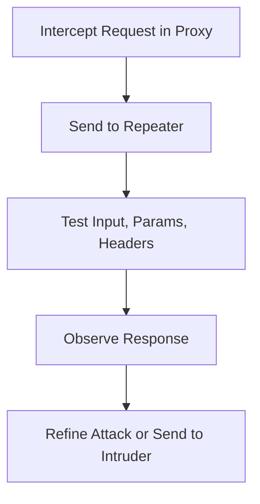
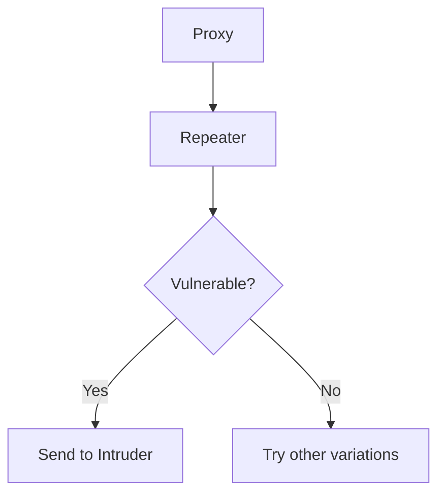

# 🔁 Repeater – Deep Dive

## 🧠 **What Is It?**

**Repeater** is a module in Burp Suite for **manually crafting and sending HTTP(S) requests**. You can send a request as many times as you like with different modifications and instantly view the raw response — all without impacting the original browser session.

- Great for **input tampering**, **PoC crafting**, **auth bypass**, etc.
- Automatically renders the response (headers/body)

**Example:**
```http
GET /profile?id=1 → Change to id=2 or id=../../../etc/passwd
````

✅ No real replacement needed. Fast and visual.

---

## 🔧 Primary Use Cases

|Task|Description|
|---|---|
|🔄 **Input Tampering**|Modify headers, cookies, parameters|
|📜 **PoC Crafting**|Build step-by-step exploits manually|
|🔐 **Auth Bypass Testing**|Strip/replace tokens or cookies|
|📦 **File Upload Testing**|Manually alter Content-Type or payload|
|🧪 **Broken Access Control**|Change user IDs or resource paths|
|🐞 **Debugging Webhooks/APIs**|Re-send and modify API calls|
|🧼 **Bypass Filters**|Test different encodings, obfuscations|

---

## 🧪 Real-World Examples

### 📌 1. **Insecure Direct Object Reference (IDOR)**

```http
GET /api/user/1234 HTTP/1.1
Cookie: session=abc

→ Change to:
GET /api/user/1235
```

Check if user A can access user B’s data.

---

### 📌 2. **Testing for XSS**

```http
GET /search?q=§
→ Change to:
GET /search?q=<script>alert(1)</script>
```

Look at the response for script execution or reflection.

---

### 📌 3. **Authentication Bypass**

```http
POST /login
Authorization: Bearer VALID_TOKEN

→ Remove or alter token
Authorization: Bearer garbage
```

Observe changes in status, response, and error messages.

---

### 📌 4. **File Upload Testing**

```http
POST /upload
Content-Type: multipart/form-data

→ Modify:
- Filename
- MIME type (e.g., `image/jpeg` → `application/x-php`)
```

---

## 🧠 Pro Features

|Feature|Description|
|---|---|
|Tabs|Each request opens in its own tab for tracking|
|Response Viewer|Shows body, headers, rendered HTML|
|Highlight/Notes|Color tabs, add comments|
|History|Keeps previous modifications|
|Context Menu|Right-click anything to send to Repeater|
|Hotkeys|Cmd/Ctrl+R sends request immediately|

---

## 🧩 Typical Workflow Pattern



---

## 🆚 Why There's No Real Replacement

|Tool|Limitation|
|---|---|
|`curl` + browser|No built-in response viewer or cookie management|
|Postman|Designed for API dev, not fuzzing or raw web hacking|
|HTTPie|CLI-based; powerful but less intuitive|
|Insomnia|Similar to Postman — not as surgical|
|Custom scripts|Good for automation, bad for exploration|

**Repeater wins** because it’s:

- **Visual** ✅
- **Instant feedback** ✅
- **State-aware (cookies/sessions)** ✅
- **Fully integrated with Proxy and Site Map** ✅

---

## 💡 Expert Tips

- Use `Ctrl+Shift+R` to instantly repeat the last request.
- Use multiple tabs to test variations side-by-side.
- Watch `Content-Length` and `Response Length` closely when testing for bypasses or info leaks.
- Repeater respects your current cookie jar unless overridden.
- Combine with **Logger++** to track and export all Repeater activity.

---

## 🚀 Bonus: PoC Crafting Template (Reusable)

Use this format in a new Repeater tab when you want to:

1. Test a token
2. Change a resource
3. Observe access pattern

```http
GET /api/private/file?id=§1234§ HTTP/1.1
Host: target.com
Authorization: Bearer §VALID_TOKEN§
Accept: */*

→ Then test:
- ID change: 1235, 0, -1, 99999
- Token manipulation: empty, expired, malformed
```

---

> [!success]  
> Think of **Repeater as your recon lab** and **Intruder as your automation cannon**. Here's how they work together in real workflows:
 

## 🧪 Repeater → Insight

Before you blast an endpoint with payloads (via Intruder or `ffuf`), you want to understand:

|Question|Repeater Helps Answer|
|---|---|
|What does this parameter do?|Change it and observe|
|Can I bypass auth by removing this cookie/header?|Try and check|
|Is this error message useful?|Trigger it manually|
|Do special characters break this input?|Test manually|
|Does XSS reflect in HTML/JS?|Try variations|
|Can I change the user ID?|Look for IDOR clues|
|Is the Content-Length or response size different?|Spot anomalies|

---

## 🎯 Intruder → Bruteforce or Automation

Once you know **where to attack**, you can:

|Action|Use Intruder to…|
|---|---|
|Fuzz a vulnerable parameter|Load wordlists|
|Brute-force a login|Use combo or cluster attacks|
|Test hundreds of inputs|Automate mutations|
|Inject payloads in multiple positions|Use Pitchfork / Cluster Bomb|

---

## 💡 Workflow Tip



---

### 🔍 Example Workflow

1. **Proxy:** Intercept login request
2. **Repeater:** Try valid user with wrong password, remove headers, switch methods
    - Observe status codes
    - Look for timing differences
    - See if there’s token reuse
3. **Repeater confirms a pattern** (e.g., response length or error message differs)
4. **Send to Intruder** to try 500+ usernames or payloads

---

### 🧠 TL;DR

- Repeater = 🔬 Focused manual testing
- Intruder = 💣 Large-scale automated attack
- Repeater gives you **confidence**, **intel**, and **control**
- Intruder gives you **power**, **speed**, and **brute-force scale**

---
Penguinified by [https://chatgpt.com/g/g-683f4d44a4b881919df0a7714238daae-penguinify](https://chatgpt.com/g/g-683f4d44a4b881919df0a7714238daae-penguinify)