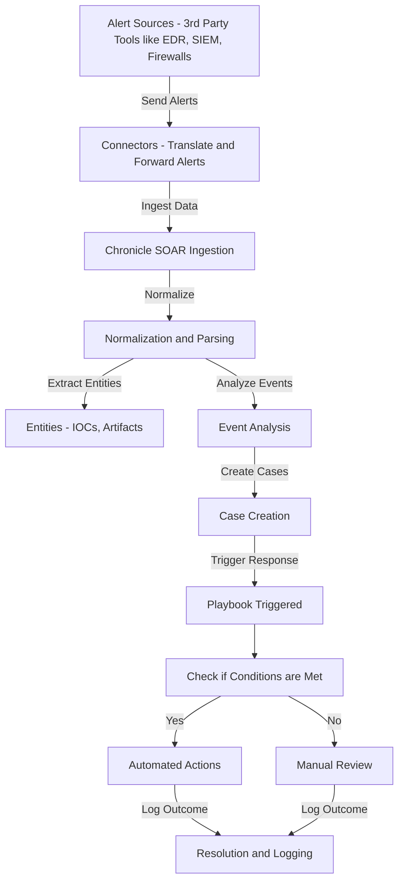

# **Chronicle SecOps Platform (SOAR)** 

It is Google Cloud’s security orchestration, automation, and response tool. It centralizes alert ingestion, enables automated playbook-driven responses, and enriches investigations with contextual data through entities. Designed to streamline security operations, it helps teams detect, investigate, and respond to incidents efficiently, reducing manual workload and improving response consistency.

---

> [!info]  
> This chart captures Chronicle's high-level workflow: from alert ingestion through connectors, to entity enrichment, playbook execution, and incident resolution.

---
## Components of Chronicle SOAR

### Connectors

Connectors serve as the ingestion points for alerts into SOAR, translating raw data into normalized formats. These are commonly derived from third-party tools.

> [!note]
> Chronicle provides out-of-the-box connectors and a Python SDK for building custom ones.

---
### Cases, Alerts, and Events

- **Cases**: Group related alerts from multiple sources.
- **Alerts**: Triggered by events and fed into the platform via connectors.
- **Events**: Observable occurrences (e.g., network activity).
- **Entities**: Extracted objects (e.g., IOCs, destinations, artifacts) that provide analytical context.

---
### Entities

Entities represent high-value extracted data points (like IOCs or artifacts). They support:
- Automatic grouping
- Threat hunting
- Contextual linking within investigations

---
### Playbooks

Playbooks define automated response workflows. They can be:
- **Triggered manually or automatically**
- **Composed of conditional actions**
- **Designed as a tree of actions reaching resolution**

> [!example]
> A playbook for “mail” product alerts might isolate suspicious messages, analyze links, and quarantine harmful content automatically.

---

## Effective SOAR Practices

Ask these questions to assess automation suitability:

- Is it routine or repetitive?
- Is precision critical?
- Is it time-consuming?

> [!tip]
> Use SOAR to reduce time spent on routine tasks, but maintain human oversight for review and tuning.

### Additional Tips

- **Standardization**: Establish scripts, procedures, and policies first.
- **Data Hygiene**: Implement purging strategies.
- **Human Involvement**: Use humans to refine workflows and conduct periodic reviews.

---
## Use Cases

- **Incident Detection and Investigation**
- **Automated Incident Response**

### Example: Email Threat Automation

> [!example]
> 1. Investigate sender reputation via threat intel
> 2. Extract and verify hyperlinks
> 3. Run code in a sandbox
> 4. Locate and quarantine related messages and attachments

> [!abstract]
> Chronicle SOAR acts as a playbook designer – a configurable workflow of triggers, actions, and steps for each event.

---
Penguinified by [Penguinify GPT 🐧](https://chatgpt.com/g/g-683f4d44a4b881919df0a7714238daae-penguinify)