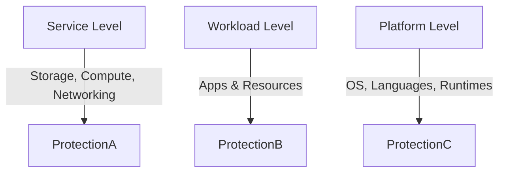
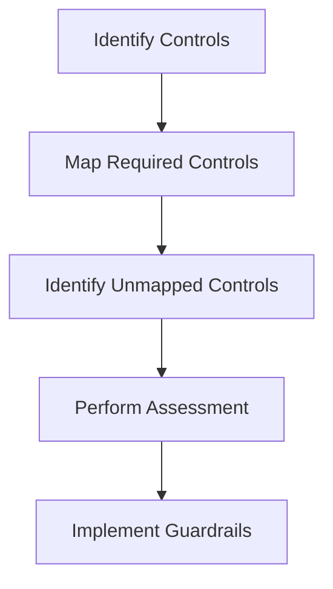
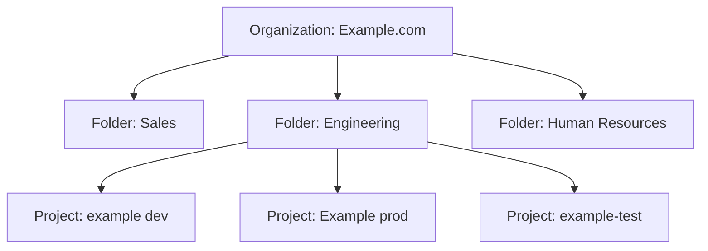

# Cloud Security Controls

## Types of Cloud Security Controls

> [!info] Classification  
> Cloud security controls are mechanisms that support risk reduction through layered defense and targeted mitigation across digital assets.

| Control Type     | Purpose                                            | Example                                                                 |
| ---------------- | -------------------------------------------------- | ----------------------------------------------------------------------- |
| **Deterrent**    | Deter attackers psychologically or informatively   | Passphrases that are harder to crack than traditional passwords         |
| **Preventative** | Strengthen and proactively secure assets           | Disabling unused ports to reduce attack surfaces                        |
| **Corrective**   | Mitigate damage after incidents                    | Scripts that repair damage and notify admins after unauthorized actions |
| **Detective**    | Identify and report ongoing or past attacks        | Antivirus software, monitoring tools                                    |
| **Compensating** | Fill gaps where standard controls can't be applied | Deadbolt added to a locked door handle                                  |

---

## Levels of Application

> [!tip] Multi-Layered Protection  
> Controls should be applied at various operational levels to ensure robust security posture.

- **Service Level:** Infrastructure components like storage and networking.
- **Workload Level:** Business applications and their supporting resources.
- **Platform Level:** Operating environments such as OSes and programming runtimes.

---

## Control Mapping Process

> [!important] Control Governance Lifecycle  
> A well-structured mapping process ensures security controls align with organizational and regulatory requirements.

1. **Identify Controls** – Inventory existing security controls within the cloud environment.
2. **Map Required Controls** – Align existing controls to frameworks like NIST, CIS, or ISO.
3. **Identify Unmapped Controls** – Detect gaps where existing controls do not meet compliance or policy standards.
4. **Perform Assessment** – Evaluate effectiveness and sufficiency of mapped controls.
5. **Implement Guardrails** – Apply policy initiatives via native cloud tools or third-party solutions.

---

---

---
Penguinified by [https://chatgpt.com/g/g-683f4d44a4b881919df0a7714238daae-penguinify](https://chatgpt.com/g/g-683f4d44a4b881919df0a7714238daae-penguinify)
