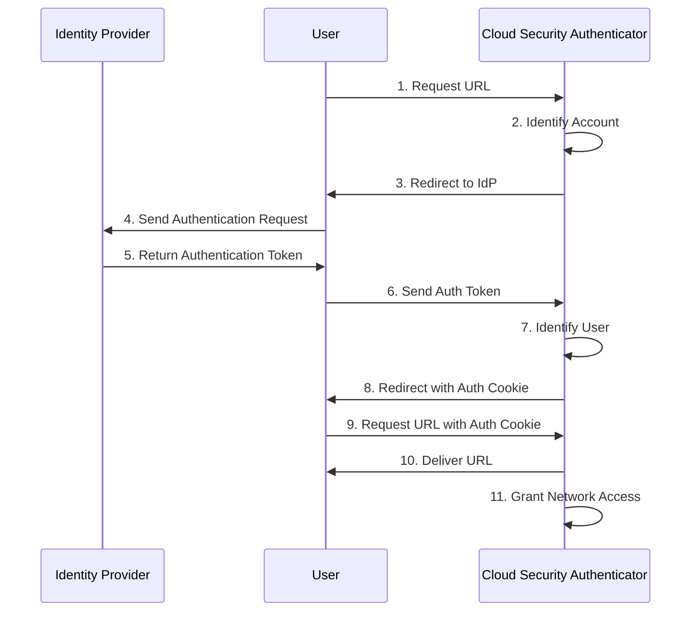

# Identity & Access Management (IAM)

> [!abstract] Summary  
> - **SAML**, **OAuth 2.0**, **OpenID Connect**
> - **RBAC**, **ABAC**, **MFA**
> 

## Services 
IAM services help keep your systems secure by managing how users log in (authentication), what they’re allowed to do (authorization), and keeping records of those actions (auditing).

In practice, IAM takes care of things like logging in with multi-factor authentication (MFA). The user either passes or fails the MFA challenge, and every attempt—successful or not—is recorded in admin or activity logs. These logs can later be reviewed to make sure people are following the right procedures and that there’s accountability.

IAM also tracks changes in role assignments, which is useful when doing yearly reviews or compliance checks. Updating IAM policies regularly—especially to follow the “least privilege” rule—helps make sure that only the right people have access to what they actually need, and nothing more.

---
## 🧾 **Principle of Least Privilege (PoLP)**

**Core Principle**: _“Only give users the minimum access they need to do their job.”_

- Limits access rights for users, applications, and systems.
- Reduces the attack surface and potential damage from breaches.
- Applies to **files, systems, networks, APIs**, and more.

---
## 🔐 **Multi-Factor Authentication (MFA)** or **Authentication Factors**

Here’s a breakdown:

|Factor Type|Description|Example|
|---|---|---|
|**Something You Know**|A secret the user knows|Password, PIN, passphrase|
|**Something You Have**|A physical object the user possesses|Smartphone, security token, smart card|
|**Something You Are**|A biometric trait|Fingerprint, facial recognition, iris scan|

---

### 🧠 Additional (Emerging) Factors

Some models expand this to include:

|Factor|Description|
|---|---|
|**Somewhere You Are**|Based on location (e.g., GPS, IP address)|
|**Something You Do**|Behavioral biometrics (e.g., typing rhythm, mouse movement)|
|**Time-Based**|Access allowed only during certain times|

---

## 🔐 What is AAA?

|Component|Description|
|---|---|
|**Authentication**|Verifies _who_ you are (e.g., username + password, biometrics).|
|**Authorization**|Determines _what_ you can access (e.g., role-based access to files or systems).|
|**Accounting**|Tracks _what_ you do (e.g., logging access times, actions taken).|

---

### 🧭 How AAA Fits into IAM

**IAM (Identity and Access Management)** is the broader discipline that governs **how identities are created, managed, and used** within an organization. AAA is the **technical foundation** that enables IAM to function.

|IAM Function|AAA Role|
|---|---|
|Identity provisioning|Supports **Authentication**|
|Access control policies|Enforced through **Authorization**|
|Audit and compliance|Enabled by **Accounting**|

---

# 🔐 Credential Management

## Authentication & Authorization Protocols

### ✅ mTLS (Mutual Transport Layer Security)

- Applies **mutual authentication**, also known as **two-way authentication** method.
- A variation of TLS where **both client and server authenticate** each other.
- Enhances trust and security in communication.

### 🔑 OAuth

- Allows applications to **access user accounts without sharing credentials**.
- Commonly used for delegated access (e.g., logging in with Google or Facebook).

### 🪪 OpenID Connect

- Provides **Single Sign-On (SSO)** functionality.
- SSO is a technology that enables users to log into multiple services with one set of credentials, also called logins. With SSO, you can ensure that your existing identity provider (IdP) remains the system of record you use to authenticate users.
- Uses an identity provider to reduce password fatigue and improve user experience.

---
# SSO **Authentication Flow Breakdown**

1. The user navigates to the console page from their browser.
2. The Cloud Security Authenticator (CSA) detects that the user is not authenticated.
3. The CSA redirects the user's browser to the Identity Provider (IdP).
4. The user's browser sends an authentication request to the IdP.
5. The IdP prompts the user to enter their credentials (username and password) and submit the login form.
6. Upon successful authentication, the IdP sends an authentication token back to the user's browser.
7. The user’s browser forwards the token to the CSA.
8. The CSA validates the token and identifies the user.
9. The CSA sets an authentication cookie and redirects the user to the intended destination URL.
10. The user requests the original URL from the CSA.
11. The CSA grants access and delivers the requested resource to the user.

---

# 🛡️ Access Control Models

### 🧾 DAC (Discretionary Access Control)

- Access is controlled by the **owner** of the resource.
- Uses **Access Control Lists (ACLs)**.
- **Example**: In Google Drive:
    - File A: View-only access to User X.
    - File B: Edit access to User Y.
    - Both files can be in the same folder, but access is **discretionary**.

---

### 🧱 MAC (Mandatory Access Control)

- Access is based on **predefined security policies**.
- Users cannot change permissions; only administrators can.
- **Example**:
    - Data classified as: Confidential, Internal, Public.
    - Access granted based on **security labels/tags**.
    - In cloud environments, MAC uses **label matching** between users and data.

---

### 🧩 RBAC (Role-Based Access Control)

Role-Based Access Control (RBAC) is a method of controlling access to resources based on the roles assigned to users. This method helps ensure users only have permissions and access to the resources necessary for their job. RBAC also lets you grant access to a collection of users via groups. Different cloud providers have their own RBAC systems, and in many cases, different products have their own RBAC features.

- Access is granted based on **roles** assigned to users.
- **Role hierarchies** simplify permission management.
- **Example**:
    - Editor role inherits Viewer permissions.
    - A user with edit access can also view, but not vice versa.

---

### 🧬 ABAC (Attribute-Based Access Control)

**ABAC (Attribute-Based Access Control)** is a method for managing access to resources based on attributes. These attributes can describe the **user** (e.g. role, department), the **resource** (e.g. file type, classification), the **action** (e.g. read, write), or the **environment** (e.g. time of day, location).

Instead of assigning permissions to specific users or roles, ABAC uses **policies** that evaluate these attributes to decide whether access should be granted. This allows for more flexible and fine-grained control compared to traditional access models like RBAC.

- Access decisions are based on **attributes**:
    - User attributes (e.g., job title)
    - Resource attributes (e.g., sensitivity level)
    - Environmental attributes (e.g., time of day)
- Involves:
    - **PDP (Policy Decision Point)**: Evaluates policies.
    - **PEP (Policy Enforcement Point)**: Enforces access decisions.

---

## ✅ Best Practices

- 🔒 Apply the [[#🧾 **Principle of Least Privilege (PoLP)**|Principle of Least Privilege (PoLP)]]
- 🔄 **Separate duties** to reduce risk
- 📋 Perform **regular audits** to ensure compliance and detect anomalies

---

Penguinified by [https://chatgpt.com/g/g-683f4d44a4b881919df0a7714238daae-penguinify](https://chatgpt.com/g/g-683f4d44a4b881919df0a7714238daae-penguinify)