> [!note]  
> This document outlines key concepts, practices, and tools to implement robust security throughout the [[3. CI-CD Pipeline|CI/CD Pipeline]].

## 🧊 Overview

Securing the [[3. CI-CD Pipeline|CI/CD Pipeline]] ensures that security is baked into every step of the software delivery lifecycle. It emphasizes early detection (shift-left), strong authentication, automated testing, and secure toolchains.

## 🛡️ Key Practices

1. Define security requirements, policies, standards, and controls.
2. Conduct code reviews, and vulnerability assessments.
3. Secure all infrastructure: build-servers, version control, artifact repos.
4. Integrate security testing into pipeline stages.
5. Use secure authentication and role-based access controls ([[Identity & Access Management (IAM)#🧩 RBAC (Role-Based Access Control)|RBAC]]).
6. [[Encryption|Encrypt]] data in transit and at rest.
7. Enforce secure coding: input validation, parameterized queries, secure cryptography.
8. Harden systems in the toolchain.
9. Implement pre-commit hooks for local code checks.
10. Apply continuous [[DevOps and DevSecOps#🧪 **SAST (Static Application Security Testing) Tools**|SAST]], [[DevOps and DevSecOps#🧪 **DAST (Dynamic Application Security Testing) Tools** |DAST]], [[Interactive Application Security Testing (IAST)]], and [[DevOps and DevSecOps#🧰 **Open Source SCA (Software Composition Analysis) Tools**|SCA]] testing.
11. Manage secrets and credentials securely.
12. Segregate duties and enforce environment isolation.
13. Automate security scans (e.g., [[SonarQube]]). 
14. Monitor and alert with tools like [[Prometheus]] and [[Splunk]]. 
15. Perform container image scanning (e.g., [[Clair]]).
16. Foster collaboration between development, security, and operations teams.
17. Involve [[NIST SP 800-61 R2 (Incident Response)|Incident Response]] teams for incident readiness and post-mortems.
18. Provide ongoing security education.
19. Run red, blue, and purple [[Unified Kill Chain (UKC)|Penetration Testing]] exercises.
20. Implement runtime protection for pipeline components.

## 👥 Secure the People

- Developers: Training, secure coding standards, feedback loops.
- Operations: Secure toolchains, infrastructure hardening.
- Testers: Security-focused test cases, automation integration.

## 🛠️ Tools by Category

- **Code Analysis:** [[DevOps and DevSecOps#🧪 **SAST (Static Application Security Testing) Tools**|SAST]], [[DevOps and DevSecOps#🧪 **DAST (Dynamic Application Security Testing) Tools** |DAST]], [[Interactive Application Security Testing (IAST)|IAST]]
- **Dependency Scanning:** [[DevOps and DevSecOps#🧰 **Open Source SCA (Software Composition Analysis) Tools**|SCA]]
- **[[Secrets Management]]:** Vaults, secret scanning tools
- **Infrastructure Security:** IaC scanning, container scanners (e.g., [[Clair]])
- **Compliance & Monitoring:** Compliance enforcement, vulnerability management, [[Prometheus]], [[Splunk]]
- **Automation:** Pre-commit hooks, automated pentests, AI-driven security tools

## 📋 Best Practices

> [!tip]  
> Apply "Shift Left"—embed security early and often.

- Role-based access (RBAC) and least privilege
- Segregate dev, test, and prod environments
- Enable automated security checks and immutable infrastructure
- Conduct regular audit logging and training
- Balance speed with security—automate wisely
- Maintain consistent policies across environments
- Reduce false positives, streamline tools

## 🔄 Advanced Strategies

- Security Gates
- Real-time threat detection
- Cross-team collaboration
- Automated rollbacks upon detection
- Security as Code principles
- Feedback loops for continuous improvement

## Secure CI/CD Pipeline Examples

## Example 1

```mermaid
graph LR

    Dev[👨‍💻 Developer] --> Git[📁 Git Repository]
    Git --> PreCommit[🔐 Pre-commit Hooks + SAST + Secrets Scan]
    PreCommit --> Jenkins[☸️ Jenkins Pipeline]
    Done[✅ Pipeline Complete]

    subgraph JenkinsPipeline [☸️ Jenkins Pipeline]
        Checkout[🔄 Checkout Code]
        Policy[🛡️ Policy Enforcement + RBAC + Secrets Mgmt]
        BuildSelector{🧰 Build Tool?}
        Maven[📦 Maven Build]
        NPM[npm Build]
        JavaApp[☕ Java App]
        WebApp[🌐 Web App]
        Sonar[🔍 SonarCloud + SAST + Lint + CodeQL]
        Test[🧪 Unit + Integration + Security Tests]
        Docker[🐳 Build Docker Image + Container Scan with Clair]
        Registry[📦 Push to Secure Container Registry]
        IaC[⚙️ IaC Scan + Ansible/Terraform Hardening]
        Cloud{☁️ GCP / AWS with IAM + Compliance Checks}
        Deploy[🚀 Deploy App + DAST + IAST in Staging]
        Notify[📧 Email/Slack Notification + Audit Log + Alerting]
        Monitor[📡 Runtime Monitoring + Prometheus + Splunk]
        
        Checkout --> Policy --> BuildSelector
        BuildSelector -->|Java| Maven --> JavaApp --> Sonar
        BuildSelector -->|NodeJS| NPM --> WebApp --> Sonar
        Sonar --> Test --> Docker --> Registry --> IaC --> Cloud --> Deploy --> Notify --> Monitor
    end

    Jenkins --> Checkout
    Monitor --> Done

```

---

## Example 2

### Key Pipeline Stages Illustrated

1. **Source (CodeCommit/GitHub)**
    - Repository triggers pipeline.
2. **CI Surveillance**
    - **[[DevOps and DevSecOps#🧪 **SAST (Static Application Security Testing) Tools**|SAST]]** with tools like SonarQube.
    - **[[DevOps and DevSecOps#🧰 **Open Source SCA (Software Composition Analysis) Tools**|SCA]]** for dependency vulnerabilities.
3. **Artifact Build & Container Build**
    - Creates Docker images.
    - Pushes to a registry.
4. **[[DevOps and DevSecOps#🧪 **DAST (Dynamic Application Security Testing) Tools** |DAST]] in Staging**
    - Penetration test in a staging environment.
5. **Vulnerability Aggregation**
    - All scan results feed into a risk dashboard.
6. **Deploy to Prod**
    - Secure deployment with least-privilege IAM and compliance checks.

> [!warning]  
> CI/CD security is never a one-time task. Regular audits, tool updates, and team awareness are key.

---
Penguinified by [https://chatgpt.com/g/g-683f4d44a4b881919df0a7714238daae-penguinify](https://chatgpt.com/g/g-683f4d44a4b881919df0a7714238daae-penguinify)
