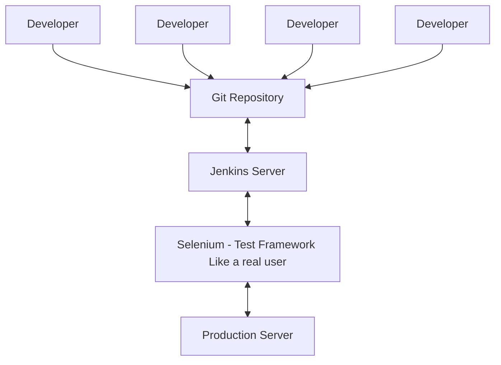

> [!note]  
> This note captures Jenkins core architecture and operational concepts for quick onboarding and reference in CI/CD infrastructure documentation.

---
# Jenkins in the center of CI/CD Pipeline

Jenkins doesn't do _everything_, but **Jenkins handles most of the automation in a CI/CD pipeline** — it's the **central orchestrator**. Here's a breakdown of what Jenkins typically does and what it relies on other tools for:



---
# 🏗️ Core Jenkins Concepts

## 🔹 Projects and Jobs

- **"Job"** and **"project"** are used interchangeably.
- A **Job** is a unit of work Jenkins executes — such as building code, running tests, or deploying applications.
- Jobs support configuration of:
    - Triggers (e.g., Git push)
    - Build steps
    - Post-build actions

### 🧱 Types of Jenkins Jobs

1. **Freestyle Project**
    - GUI-configured
    - Basic workflows
    - Suitable for beginners

2. **Pipeline**
    - Declarative or scripted
    - Supports complex workflows
    - Version-controlled

3. **Multi-Configuration Project (Matrix Job)**
    - Tests across multiple environments (e.g., Java versions, OS, browsers)

4. **Multibranch Pipeline**
    - Auto-discovers repository branches
    - Creates a pipeline per branch
    - Integrates well with GitHub/GitLab

5. **Folder**
    - Organizes jobs
    - Enhances scalability

6. **External Job**
    - Monitors externally run jobs
    - Rare in modern CI setups


---


## 🔹 Pipelines

- A **pipeline** is a **scripted or declarative workflow** of interconnected stages.
- Defined in a `Jenkinsfile`, often stored in version control. You can create Pipelies with a Pipeline script or the Web UI, or even run bash scripts Jenkinsfile (Best Practice): Is a file that will be sitting in the root of your repo.
- Pipelines support:
    - Parallel execution
    - Conditionals
    - Parameters
    - Shared libraries

**Two pipeline types:**
- **Declarative:** Structured, preferred for readability
- **Scripted:** Groovy-based, more flexible

---
### 🧾 Declarative Pipeline (Beginner-Friendly)

✅ What it is:

- Think of it like a **recipe**: you declare what you want to happen and in what order.
- It’s **structured**, **easier to read**, and **recommended for most users**.
- You define **stages** like `Build`, `Test`, and `Deploy`.

🧠 Analogy:

> “Hey Jenkins, here’s a checklist. First build the app, then test it, then deploy it.”

🧪 Example:

```groovy
pipeline {
    agent any  // Use any available Jenkins agent

    stages {
        stage('Build') {
            steps {
                echo '🔧 Building the application...'
                // e.g., run a build command like: mvn clean install
            }
        }
        stage('Test') {
            steps {
                echo '🧪 Running tests...'
                // e.g., run unit tests or Postman tests
            }
        }
        stage('Deploy') {
            steps {
                echo '🚀 Deploying to production...'
                // e.g., push Docker image to registry or deploy to Kubernetes
            }
        }
    }
}
```

---

### 🧾 Scripted Pipeline (More Flexible, More Code)

✅ What it is:

- Think of it like **writing a script**: you tell Jenkins exactly what to do, step by step.
- It’s **more powerful**, but **less structured**.
- Great for **complex logic** or **dynamic behavior**.

🧠 Analogy:

> “Hey Jenkins, here’s a custom script. Run these commands exactly as I wrote them.”

🧪 Example:

```groovy
node {
    stage('Build') {
        echo '🔧 Building the application...'
        // You can use shell commands like:
        sh 'npm install'
    }

    stage('Test') {
        echo '🧪 Running tests...'
        sh 'npm test'
    }

    stage('Deploy') {
        echo '🚀 Deploying to production...'
        sh 'docker build -t myapp .'
        sh 'docker push myregistry/myapp'
    }
}
```


> [!tip]  
> Declarative pipelines are ideal for teams seeking readability, while scripted pipelines offer advanced control when needed.

---
### Sample pipeline

```mermaid
graph LR

    Dev[👨‍💻 Developer] --> Git[📁 Git Repository]
    Git --> Jenkins[☸️ Jenkins Pipeline]
    Done[✅ Pipeline Complete]

    subgraph JenkinsPipeline [☸️ Jenkins Pipeline]
        Checkout[🔄 Checkout Code]
        BuildSelector{🧰 Build Tool?}
        Maven[📦 Maven Build]
        NPM[npm Build]
        JavaApp[☕ Java App]
        WebApp[🌐 Web App]
        Sonar[🔍 SonarCloud Analysis]
        Test[🧪 Automated Tests]
        Docker[🐳 Build Docker Image]
        Registry[📦 Push to Container Registry]
        IaC[⚙️ Ansible / Terraform]
        Cloud{☁️ GCP / AWS}
        Deploy[🚀 Deploy App]
        Notify[📧 Email Notification]
        

        Checkout --> BuildSelector
        BuildSelector -->|Java| Maven --> JavaApp --> Sonar
        BuildSelector -->|NodeJS| NPM --> WebApp --> Sonar
        Sonar --> Test --> Docker --> Registry --> IaC --> Cloud --> Deploy --> Notify
    end

    Jenkins --> Checkout
    Notify --> Done[✅ Pipeline Complete]

```




---


## 🔹 Build Queue

- The **build queue** holds jobs waiting to run.
- Jobs queue if no executor is immediately available.
- Ensures controlled execution flow and system load management.

---

## 🔹 Build Executor

- Executors are **threads on Jenkins agents** that run jobs.
- Jenkins Controller (Master) has at least one executor by default.
- Agent nodes can be configured with additional executors.


---


## 🔹 Plugins and Capabilities

## What Jenkins Does Well

1. **Continuous Integration (CI)**
    
    - Pulls code from Git repositories
    - Builds the application (e.g., compiles, packages)
    - Runs automated tests (unit, integration, etc.)
    - Performs static code analysis (e.g., SonarQube, Checkmarx)

2. **Continuous Delivery/Deployment (CD)**
    - Deploys to staging or production environments
    - Triggers infrastructure provisioning (e.g., Terraform, Ansible)
    - Sends notifications (Slack, email, dashboards)

3. **Pipeline Orchestration**
    - Coordinates tools like Docker, Kubernetes, Selenium, etc.
    - Manages complex workflows using Jenkinsfiles (written in Groovy)


#### 🧰 Jenkins Plugin Automation Breakdown 

| **Task**                          | **Tool**                    | **Jenkins Plugin(s)**                                                                     |
| --------------------------------- | --------------------------- | ----------------------------------------------------------------------------------------- |
| **Code Hosting**                  | GitHub, GitLab, Bitbucket   | GitHub Plugin<br>GitLab Plugin<br>Bitbucket Plugin                                        |
| **Containerization**              | Docker                      | Docker Pipeline Plugin<br>Docker Commons Plugin                                           |
| **Infrastructure as Code**        | Terraform, Ansible          | Terraform Plugin<br>Ansible Plugin                                                        |
| **Build & Dependency Management** | Maven, npm                  | Maven Integration Plugin (Java)<br>NodeJS Plugin (for npm javascript)                     |
| **Testing**                       | JUnit, Selenium, Cypress    | JUnit Plugin<br>Selenium Plugin<br>HTML Publisher Plugin                                  |
| **Security Scanning**             | OWASP ZAP, Snyk, Trivy      | OWASP ZAP Plugin<br>Snyk Security Plugin<br>custom shell steps for Trivy                  |
| **Deployment**                    | Kubernetes, AWS, Azure, GCP | Kubernetes Plugin<br>AWS CodeDeploy Plugin<br>Azure CLI Plugin<br>Google Cloud SDK Plugin |

#### Plugin Categories:
- UI Plugins: Deal with how things look like.
- Platform Plugins: Depend on the OS it is installed on
- Administration Plugins: Information for users, dashboards, etc..
- Build Management Plugins: Things that are triggered upon build actions/results
- Source code Management Plugins: How to manage each version control systems (GitHub)

#### 🧠 Notes:

- **Maven Plugin** allows Jenkins to run Maven goals like `clean install`, `package`, etc.
- **NodeJS Plugin** sets up Node.js and npm environments so Jenkins can run `npm install`, `npm test`, etc.


---


## 🔹 Architecture: Master and Agents

## 🟨 Jenkins Master (Controller)

- Central orchestration unit.
    
- Responsibilities:
    - Web UI
    - Job scheduling and queuing
    - Agent monitoring
    - Configuration and log storage

> [!warning]  
> Avoid running heavy builds on the controller. Use agents for compute-intensive tasks.

## 🟩 Jenkins Agent (Node)

- Executes actual workloads (build, test, deploy).
- Connects via SSH, JNLP, Docker, or Kubernetes.
- Can be labeled (e.g., `docker`, `nodejs`) for job routing.

---
Penguinified by [https://chatgpt.com/g/g-683f4d44a4b881919df0a7714238daae-penguinify](https://chatgpt.com/g/g-683f4d44a4b881919df0a7714238daae-penguinify)
