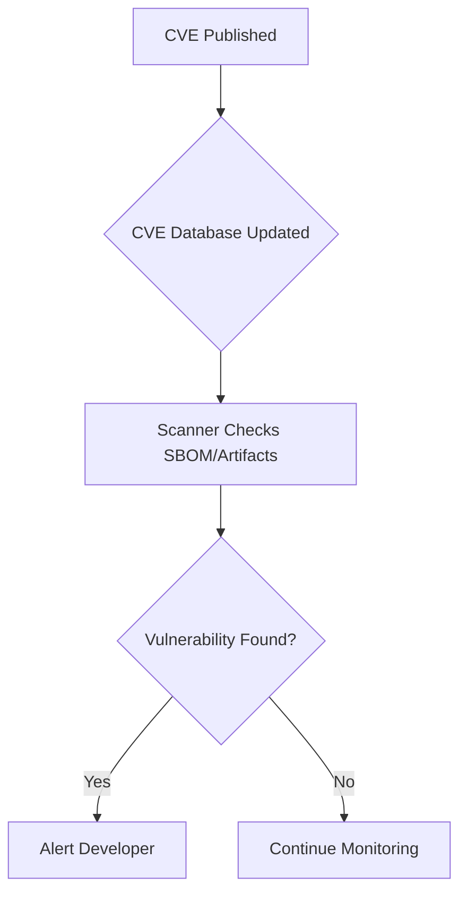

> [!summary] Core Concept  
This note outlines various software development methodologies and security strategies—from traditional waterfall approaches to modern [[3. CI-CD Pipeline|CI/CD Pipelines]] including insights into supply chain security and SBOM implementation.

# 🧱 Traditional Development

## Waterfall Approach

Divided into 6 steps:
1. Establish project requirements  
2. Design the software  
3. Develop the software  
4. Test code  
5. Release the project  
6. Conduct maintenance  

### Drawbacks
- Testing failures halt the entire flow  
- Team interdependency can block progress  

---

# 🔄 Modern Software Development

## Software Pipelines

Automated processes used to streamline the software lifecycle:

### Common Features ([[3. CI-CD Pipeline|CI/CD Pipelines]]):
1. Automated integration and testing  
2. Code validation  
3. Reporting measures  

> Helps developers release updates rapidly and reduce disruptions.

---

### 🔐 Security in CI/CD

- Integrated automated security testing  
- Tests during each stage of CI/CD  
- Reduces manual effort, improves app health  

---

# 🧩 Software Supply Chain Security

## 🔐 What is the Software Supply Chain?

All people, processes, and tools involved in software development:

- Code & repos  
- CI/CD tools  
- Third-party packages  
- Human roles and policies  

> [!info] Did You Know?  
> A single compromised library can cascade across thousands of systems.

---

## 🛠️ Attack Surface

### 👥 People  
Targets for phishing, insider threats, credential theft  

### 🔄 Processes  
Weak policy enforcement, poor access control  

### 🧩 Technology  
Malicious containers, plugins, or libraries  

> [!warning] Caution Ahead  
> ⚠️ People remain the most vulnerable vector.

---

## 🧨 Threat Actor Flow

```mermaid
flowchart TD
    A[Threat Actor Recon] --> B[Identify People/Process/Tech Weaknesses]
    B --> C[Compromise CI/CD or Source Code]
    C --> D[Inject Malware / Backdoor]
    D --> E[Release Software to Public]
    E --> F[Exploit Users and Infrastructure]
````

---

## 🛡️ Defense Strategies

1. Security Hardening: Limit the attack surface via config and infra
2. Continuous Vulnerability Checks: Run automated scans in CI/CD
3. SBOM:  Track components in use → [[#🧾 Software Bill of Materials (SBOM)]]

> [!tip] Helpful Tip
> 💡 SBOMs increase transparency and ensure compliance.

---
## 🍕 Software Supply Chain Analogy

> Software is like making a pizza.

* Ingredients = code & tools
* Recipe = build process
* Chef = developers
* Kitchen = infra & clouds

> [!note] Quick Reminder
> Hackers target any part—bad ingredients, tricked chefs, or open kitchens.

---

## 🛡️ Supply Chain Security Frameworks

### SLSA Framework

```mermaid
graph TD
    A[Level 1: Provenance] --> B[Level 2: Build Integrity]
    B --> C[Level 3: Reproducible Builds]
    C --> D[Level 4: Hermetic Builds]
```

> [!quote] Prompt Wisdom
> “SLSA ensures trust and verification, not just CVE detection.”

→ See: [[SLSA Framework (Software Supply Chain)]]

---

## 🧾 Software Bill of Materials (SBOM)

Machine-readable inventory of software components:

| Tool          | Description                  | Format          |
| ------------- | ---------------------------- | --------------- |
| **Syft**      | SBOM from code/containers    | CycloneDX, SPDX |
| **CycloneDX** | OWASP SBOM format            | JSON, XML       |
| **SPDX**      | Linux Foundation open format | RDF, JSON, [[YAML]] |

> [!tip] Why It Matters
> CVEs are easier to trace when SBOMs are available.

---
## ✅ Final Recommendations

* Harden pipelines
* Use access controls
* Generate/review SBOMs
* Audit dependencies regularly
* Educate personnel


---

# 🛡️ CVE Detection in Software

## Vulnerability Scanners

| Tool           | Scans                                                                     | Integrations       |
| -------------- | ------------------------------------------------------------------------- | ------------------ |
| **Snyk**       | Code, [[Infrastructure Automation#🛠️ Infrastructure as Code (IaC)\|IaC]] | GitHub, GitLab     |
| **Trivy**      | Containers, FS                                                            | [[Docker]], K8s        |
| **Dependabot** | GitHub PRs                                                                | Native integration |
| **OWASP DC**   | Java, .NET                                                                | CI/CD pipelines    |

---

## 📦 Artifact Registries with CVE Tools

| Registry          | CVE Scanning | Notes                  |
| ----------------- | ------------ | ---------------------- |
| JFrog Artifactory | ✅            | Built-in Xray          |
| GitHub Packages   | ✅            | Linked with Dependabot |
| [[Docker]] Hub        | ✅            | Basic scan shown       |

---

## 🔁 CVE Scan Workflow



---

## ✅ Best Practices

* ✅ SBOM for every release
* ✅ Use CI-integrated scanners
* ✅ Favor SLSA-compliant artifacts
* ✅ Monitor CVE feeds regularly

> [!warning] Stay Ahead
> ⚠️ Scan dev and prod environments consistently.
