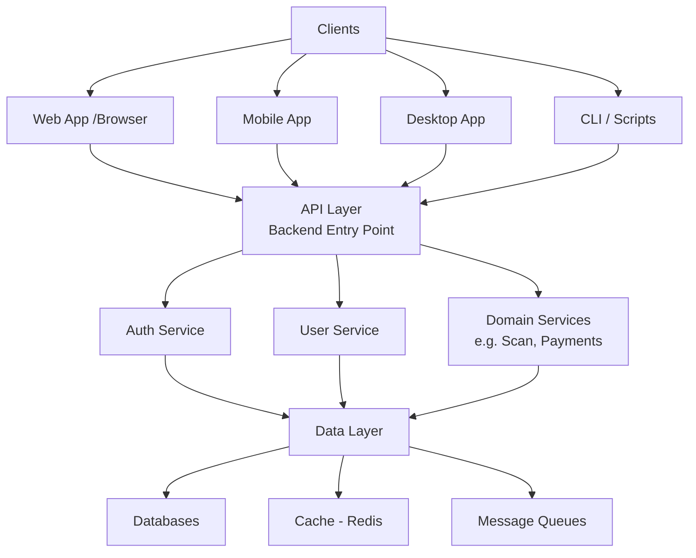

# 🧠 Modern Application Architecture Overview  
  
## 🧩 Core Concept  
  
Modern applications are typically divided into:  
  
- **Frontend** → User interface (UI)  
- **Backend** → Business logic, APIs, and data handling  
  
---  
  
## 🎨 Frontend Architecture  
  
### 🟢 Monolithic Frontend  
- Single application (e.g., React, Angular, Vue)  
- One codebase and deployment  
  
### 🟡 Micro Frontends (MFEs)  
- Multiple independently developed frontends  
- Combined into a single UI  
- Each team owns a specific domain  
  
> [!note]  
> Micro Frontends are primarily about **team scalability**, not performance.  
  
---  
  
## ⚙️ Backend Architecture  
  
### 🟢 Monolithic Backend  
- Single service handling all logic  
- Easier to start, harder to scale  
  
### 🔵 Microservices Architecture  
- Multiple independent services:  
  - Auth Service  
  - User Service  
  - Payments / Scan Service  
- Each service:  
  - Owns its own logic  
  - Often owns its own database  
  
### Communication Methods  
- REST (most common)  
- GraphQL (modern alternative)  
- gRPC (high performance)  
- Message queues (Kafka, RabbitMQ)  
  
> [!important]  
> Microservices improve scalability and team independence, but increase system complexity.  
  
---  
  

## ⚙️ Core Infrastructure Components

### 🔹 API Gateway
An API Gateway is the main entry point between clients and backend services.

**Purpose:**
- Centralizes incoming traffic
- Simplifies access to multiple backend services
- Enforces common controls before requests reach internal systems

**Responsibilities:**
- Authentication
- Authorization
- Request routing
- Rate limiting
- Logging and monitoring

> [!note]
> Clients should not directly interact with internal microservices. The API Gateway acts as the controlled entry point.

---

### 🔹 Load Balancing
Load balancing distributes traffic across multiple instances of the same service.

**Purpose:**
- Prevents overload on a single instance
- Improves availability and fault tolerance
- Enables horizontal scaling

**Example:**
Traffic is distributed across multiple backend instances instead of hitting a single server.

---

### 🔹 Caching
Caching stores frequently requested data temporarily for faster access.

**Purpose:**
- Reduces database load
- Improves response times
- Avoids repeated computations

**Common layers:**
- Application cache (e.g., Redis)
- CDN (static assets)
- Browser cache

> [!important]
> Caching introduces complexity around data consistency and invalidation.

---

### 🔹 Asynchronous Processing
Asynchronous processing handles long-running tasks in the background.

**Purpose:**
- Keeps APIs fast and responsive
- Offloads heavy operations
- Improves system scalability

**Common pattern:**
1. Client sends request
2. Backend queues the job
3. Worker processes it asynchronously
4. Results are stored or returned later

**Examples:**
- Security scans (your DAST case)
- Report generation
- Email notifications

> [!important]
> If a task takes more than a few seconds, it should typically be handled asynchronously.

---  
  

## 🌐 Clients (Frontend Consumers)  
  
Modern systems support multiple client types:  
  
- Web applications (browser)  
- Mobile apps (iOS, Android)  
- Desktop apps (Windows, macOS, Linux)  
- CLI tools / scripts  
  
> [!tip]  
> The backend is **client-agnostic** — all clients communicate via APIs.  
  

---

## 🖥️ Web vs Native Applications  
  
### 🌐 Web Apps  
- Run in browser  
- No installation required  
- Universal compatibility  
  
### 📱 Native Apps  
- Built per platform (Swift, Kotlin, etc.)  
- Better performance and OS integration  
- Still communicate with backend APIs  
  
### 🟡 Hybrid Apps  
- Built with web tech but packaged as native apps  
- Examples: Electron, React Native  
  
---  
  
## 🌍 Web Availability  
  
Most large applications provide a web version because:  
- Works across all devices  
- No installation needed  
- Easier distribution  
  
> [!warning]  
> Not all apps start as web-first. Some are mobile-first or desktop-first.  
  
---  
  
## 🔄 System Architecture Overview  

---

> [!NOTE] Final Mental Model
> 
> Modern applications are:
> 
> > Multi-client systems (web, mobile, CLI) interacting with distributed backend services via APIs, often coordinated through gateways, queues, and cloud infrastructure.
> 

  
---
Penguinified by [https://chatgpt.com/g/g-683f4d44a4b881919df0a7714238daae-penguinify](https://chatgpt.com/g/g-683f4d44a4b881919df0a7714238daae-penguinify)
