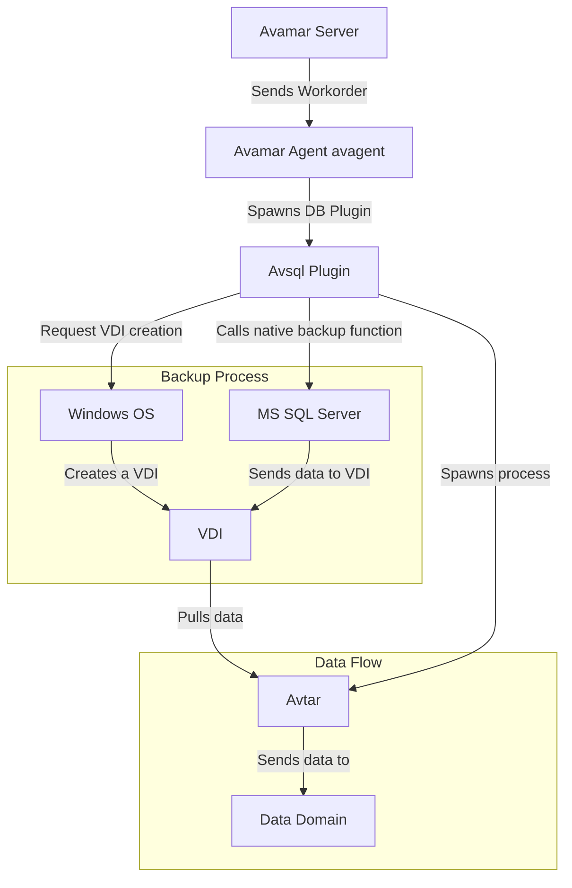

# Backup

```mermaid
graph TB
A[Avamar Server] -->|Sends Workorder| B[Avamar Agent avagent]
B -->|Spawns DB Plugin| C[Avsql Plugin]
C -->|Request VDI creation| E[Windows OS]
C -->|Calls native backup function| F[MS SQL Server]
    subgraph Backup Process
        E -->|Creates a VDI| D
        F -->|Sends data to VDI| D[VDI]
    end

    subgraph Data Flow
        D -->|Pulls data| H
        H -->|Sends data to| I[Data Domain]
    end
C -->|Spawns process| H[Avtar]
   
```

