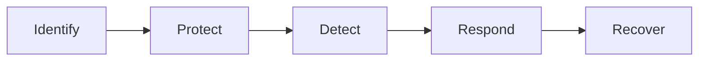

## 📌 **NIST Cybersecurity Framework (CSF) — Quick Reference**

> [!summary] Core Concept  
> A flexible, risk-based framework developed by **NIST** to help organizations manage and reduce cybersecurity risks across sectors.

---

### 🧩 **Framework Core: 5 Key Functions**

These are **interdependent** categories of cybersecurity activities:

---

### 1. 🔍 **Identify**

> Understand your organizational environment to manage cybersecurity risks.

- Asset Management
- Business Environment
- Governance
- Risk Assessment
- Risk Management Strategy
- Supply Chain Risk Management

---

### 2. 🛡️ **Protect**

> Implement safeguards to limit the impact of potential events.

- Access Control
- Awareness and Training
- Data Security
- Information Protection Processes and Procedures
- Maintenance
- Protective Technology

---

### 3. 🚨 **Detect**

> Identify the occurrence of a cybersecurity event.

- Anomalies and Events
- Security Continuous Monitoring
- Detection Processes

---

### 4. 🚒 **Respond**

> Take action regarding a detected incident.

- Response Planning
- Communications
- Analysis
- Mitigation
- Improvements

---

### 5. 🔁 **Recover**

> Restore capabilities or services after a cyber event.

- Recovery Planning
- Improvements
- Communications

---

### 🧭 **Framework Tiers**

Reflect **maturity of risk management** processes:

- **Tier 1:** Partial
- **Tier 2:** Risk Informed
- **Tier 3:** Repeatable
- **Tier 4:** Adaptive

---

### 🎯 **Framework Profile**

Tailored implementation aligned with:

- Business needs
- Risk tolerance
- Resources

Used for **gap analysis** between current and target cybersecurity posture.

---

> [!tip] Helpful Tip  
> 🔄 You can align your current security policies and tools (like SIEMs, firewalls, training programs) directly to the CSF's 5 core functions to spot gaps and prioritize actions.