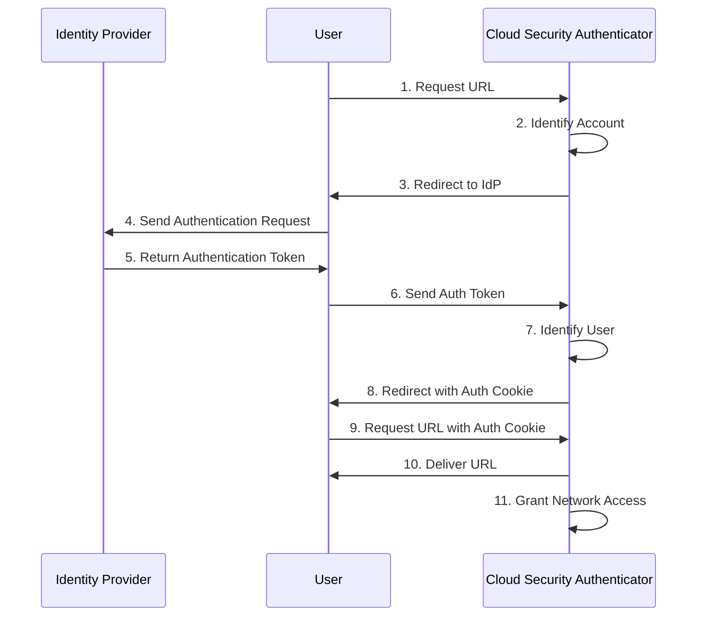

# Identity & Access Management (IAM)

> [!abstract] Summary  
> - **SAML**, **OAuth 2.0**, **OpenID Connect**
> - **RBAC**, **ABAC**, **MFA**
> 

## RBAC
Role-Based Access Control (RBAC) is a method of controlling access to resources based on the roles assigned to users. This method helps ensure users only have permissions and access to the resources necessary for their job. RBAC also lets you grant access to a collection of users via groups. Different cloud providers have their own RBAC systems, and in many cases, different products have their own RBAC features.

---
## SSO
SSO is a technology that enables users to log into multiple services with one set of credentials, also called logins. With SSO, you can ensure that your existing identity provider (IdP) remains the system of record you use to authenticate users.

1. User: request URL 
2. Cloud Security Authenticator: Identify Account
3. Cloud Security Authenticator: Redirect User to IdP
4. User: sends Authentication request to Identity Provider
5. IdP: Authentication toke from IdP sent to user
6. User: sends Auth token to CSA
7. CSA: Identifies user
8. CSA: Redirects user to URL with auth cookie set.
9. User: Request URL from CSA
10. CSA: Delivers URL to User
11. CSA: Grants user access to network

---

## IAM

---
 
## 🔐 **Multi-Factor Authentication (MFA)** or **Authentication Factors**

Here’s a breakdown:

|Factor Type|Description|Example|
|---|---|---|
|**Something You Know**|A secret the user knows|Password, PIN, passphrase|
|**Something You Have**|A physical object the user possesses|Smartphone, security token, smart card|
|**Something You Are**|A biometric trait|Fingerprint, facial recognition, iris scan|

---

### 🧠 Additional (Emerging) Factors

Some models expand this to include:

|Factor|Description|
|---|---|
|**Somewhere You Are**|Based on location (e.g., GPS, IP address)|
|**Something You Do**|Behavioral biometrics (e.g., typing rhythm, mouse movement)|
|**Time-Based**|Access allowed only during certain times|

---

## 🔐 What is AAA?

|Component|Description|
|---|---|
|**Authentication**|Verifies _who_ you are (e.g., username + password, biometrics).|
|**Authorization**|Determines _what_ you can access (e.g., role-based access to files or systems).|
|**Accounting**|Tracks _what_ you do (e.g., logging access times, actions taken).|

---

### 🧭 How AAA Fits into IAM

**IAM (Identity and Access Management)** is the broader discipline that governs **how identities are created, managed, and used** within an organization. AAA is the **technical foundation** that enables IAM to function.

|IAM Function|AAA Role|
|---|---|
|Identity provisioning|Supports **Authentication**|
|Access control policies|Enforced through **Authorization**|
|Audit and compliance|Enabled by **Accounting**|

---

_**Penguinified by [https://chatgpt.com/g/g-683f4d44a4b881919df0a7714238daae-penguinify](https://chatgpt.com/g/g-683f4d44a4b881919df0a7714238daae-penguinify)**_
