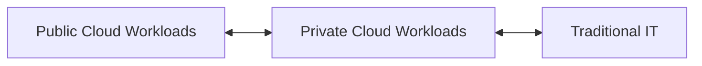

> [!summary] 🌐 Failure Domains in Cloud Architecture  
> The [[Digital Transformation Journey]] introduces **failure domains**—resources that can fail without affecting data availability. These domains are composed of **zones** (groups of data centers in an area) and **regions** (groups of zones). They enable [[Data Center Implementation#Redundancy|redundancy]], reduce [[Networking/Foundations#Latency|latency]] for end users, and provide [[Data Protection/Foundations#Resiliency|resiliency]] across operations.

---
# Benefits of Cloud Computing


1. Faster Time to Market: Quickly create infrastructure and deploy new apps without the delays of hardware setup.
2. Scalability: Automatically match resources to workload, saving time, effort, and money.
3. Cost Savings: Pay only for the resources you use, reducing expenses on physical hardware and maintenance.
4. Better Collaboration: Access data from anywhere with an internet connection, enabling efficient teamwork across the globe.
5. Enhanced Security: Ensure data confidentiality, integrity, and availability with robust security measures and redundancy practices.
---

# ☁️ Cloud Deployment Models

| Feature              | Public Cloud                          | Private Cloud                        | Hybrid Cloud                                       | Multi-Cloud                                                  |
| -------------------- | ------------------------------------- | ------------------------------------ | -------------------------------------------------- | ------------------------------------------------------------ |
| **Ownership**        | Third-party provider                  | Single organization                  | Mixed (Public + Private + possibly Traditional IT) | Multiple public cloud providers                              |
| **Resource Sharing** | Publicly shared                       | Privately shared                     | Shared across clouds and/or data centers           | Shared across independent public clouds                      |
| **Customer Type**    | Multiple customers (multi-tenant)     | Cluster of customers / Single tenant | Shared workloads depending on business needs       | Different workloads across providers                         |
| **Connectivity**     | Internet                              | Internet, Fibre, Private Networks    | Combined connectivity (based on architecture)      | Internet                                                     |
| **Use Case Fit**     | Less confidential info, scalable apps | Core systems, confidential data      | Mixing sensitive and non-sensitive workloads       | Best-of-breed services for each business area                |
| **Examples**         | AWS, Azure, GCP                       | VMware VCF on VxRail, OpenStack      | Datacenter + Azure; VxRail + AWS                   | Office365 (Docs) + Salesforce (CRM) + Google Cloud (Storage) |

---

## 🔄 Hybrid Cloud vs. Multi-Cloud Operations

### 🔸 Hybrid Cloud
> **Hybrid Cloud** is the integration of **Public Cloud**, **Private Cloud**, and possibly **Traditional IT** (on-prem datacenters).  
 
Use case: when workloads need to shift across environments based on compliance, latency, or cost.



### 🔹 Multi-Cloud
> **Multi-Cloud** refers to using **multiple independent public cloud services** in parallel for different workloads.

Example Toolbox:
```
Office365 → Document Workloads  
Salesforce → CRM  
Google Cloud → Storage
```

Each service operates **independently**, selected based on the best fit for the application or department.

---

### IaaS
### PaaS
### SaaS

### Backend as a service (BaaS)


BaaS is a form of serverless computing where the CSP manages all aspects of the backend infrastructure. This includes servers, containers, and virtual machines. Developers use BaaS to speed the creation of web applications. With BaaS, developers can focus on writing the front end code, which is the code that builds the user interface. Organizations have access to other services, like databases, file storage, and authentication services that can be native or third party to the platform

### Function as a service (FaaS)

FaaS is a form of serverless computing that runs functions. A function is a small piece of code. Functions are ephemeral, meaning they only exist for a short period of time. Developers can use their choice of programming language to create functions, which makes adopting serverless computing more convenient.

> [!info] 🔒 Did You Know? 
> The short lifespan of functions contributes to their [[Google Cloud Security|Security]]. Since each function is short-lived, malicious actors have a very limited window to impose threats. Also, each function has a single role in a software application. If a malicious actor were to gain access to a function, they could only threaten the part of the application that uses that function.


---

# Infrastructure as Code (IaC)