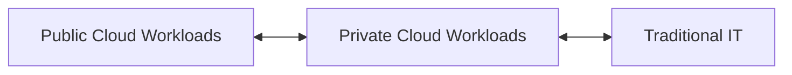
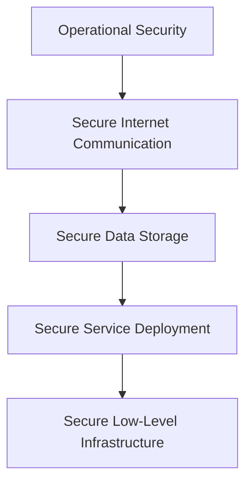

Starts with the [[Digital Transformation Journey]]

Failure domain: A resource that can fail without impacting the availability of data
Composed of Zones: The collective number of data centers in an area
And Regions: A group of zones

Failure Domains enable [[Data Center Implementation#Redundancy|Redundancy]] with reduced [[Networking/Foundations#Latency|Latency]] for end users, and provide [[Data Protection/Foundations#Resiliency|Resiliency]]resiliency across the operations.

---
# ☁️ Cloud Deployment Models

| Feature                        | Public Cloud                            | Private Cloud                            | Hybrid Cloud                                                               | Multi-Cloud                                                           |
|-------------------------------|-----------------------------------------|------------------------------------------|----------------------------------------------------------------------------|------------------------------------------------------------------------|
| **Ownership**                 | Third-party provider                    | Single organization                      | Mixed (Public + Private + possibly Traditional IT)                        | Multiple public cloud providers                                       |
| **Resource Sharing**          | Publicly shared                         | Privately shared                         | Shared across clouds and/or data centers                                  | Shared across independent public clouds                              |
| **Customer Type**            | Multiple customers (multi-tenant)       | Cluster of customers / Single tenant     | Shared workloads depending on business needs                              | Different workloads across providers                                 |
| **Connectivity**              | Internet                                | Internet, Fibre, Private Networks        | Combined connectivity (based on architecture)                             | Internet                                                              |
| **Use Case Fit**              | Less confidential info, scalable apps  | Core systems, confidential data          | Mixing sensitive and non-sensitive workloads                             | Best-of-breed services for each business area                        |
| **Examples**                  | AWS, Azure, GCP                        | VMware VCF on VxRail, OpenStack          | Datacenter + Azure; VxRail + AWS                                          | Office365 (Docs) + Salesforce (CRM) + Google Cloud (Storage)         |

---

## 🔄 Hybrid Cloud vs. Multi-Cloud Operations

### 🔸 Hybrid Cloud
> **Hybrid Cloud** is the integration of **Public Cloud**, **Private Cloud**, and possibly **Traditional IT** (on-prem datacenters).  
 
Use case: when workloads need to shift across environments based on compliance, latency, or cost.



### 🔹 Multi-Cloud
> **Multi-Cloud** refers to using **multiple independent public cloud services** in parallel for different workloads.

Example Toolbox:
```
Office365 → Document Workloads  
Salesforce → CRM  
Google Cloud → Storage
```

Each service operates **independently**, selected based on the best fit for the application or department.

---

[[Security in the cloud (5 Layers).canvas|Security in the cloud (5 Layers)]]




