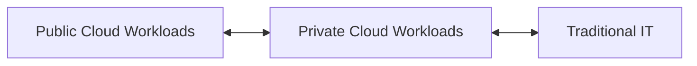
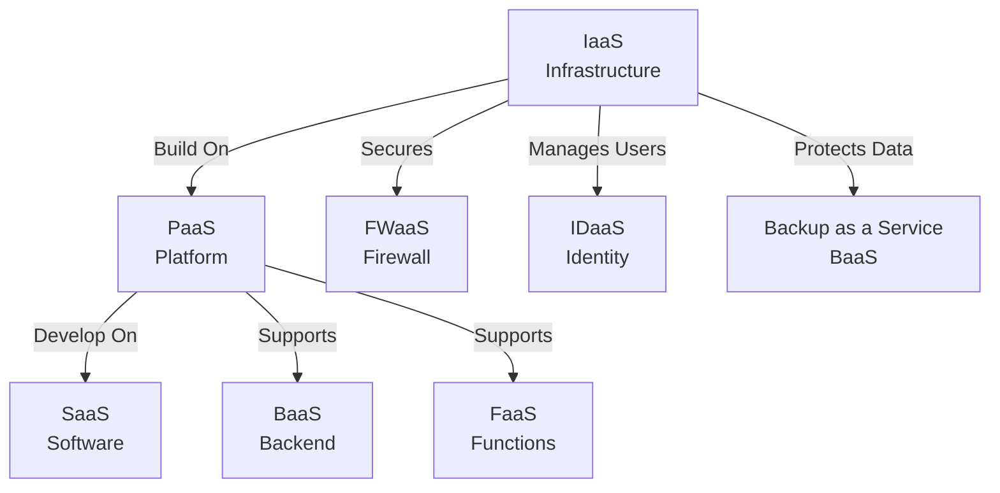

> [!summary] 🌐 Failure Domains in Cloud Architecture  
> The [[Digital Transformation Journey]] introduces **failure domains**—resources that can fail without affecting data availability. These domains are composed of **zones** (groups of data centers in an area) and **regions** (groups of zones). They enable [[Data Center Implementation#Redundancy|redundancy]], reduce [[Networking/Foundations#Latency|latency]] for end users, and provide [[Data Protection/Foundations#Resiliency|resiliency]] across operations.

---
# Benefits of Cloud Computing


1. Faster Time to Market: Quickly create infrastructure and deploy new apps without the delays of hardware setup.
2. Scalability: Automatically match resources to workload, saving time, effort, and money.
3. Cost Savings: Pay only for the resources you use, reducing expenses on physical hardware and maintenance.
4. Better Collaboration: Access data from anywhere with an internet connection, enabling efficient teamwork across the globe.
5. Enhanced Security: Ensure data confidentiality, integrity, and availability with robust security measures and redundancy practices.
---

# ☁️ Cloud Deployment Models

| Feature              | Public Cloud                          | Private Cloud                        | Hybrid Cloud                                       | Multi-Cloud                                                  |
| -------------------- | ------------------------------------- | ------------------------------------ | -------------------------------------------------- | ------------------------------------------------------------ |
| **Ownership**        | Third-party provider                  | Single organization                  | Mixed (Public + Private + possibly Traditional IT) | Multiple public cloud providers                              |
| **Resource Sharing** | Publicly shared                       | Privately shared                     | Shared across clouds and/or data centers           | Shared across independent public clouds                      |
| **Customer Type**    | Multiple customers (multi-tenant)     | Cluster of customers / Single tenant | Shared workloads depending on business needs       | Different workloads across providers                         |
| **Connectivity**     | Internet                              | Internet, Fibre, Private Networks    | Combined connectivity (based on architecture)      | Internet                                                     |
| **Use Case Fit**     | Less confidential info, scalable apps | Core systems, confidential data      | Mixing sensitive and non-sensitive workloads       | Best-of-breed services for each business area                |
| **Examples**         | AWS, Azure, GCP                       | VMware VCF on VxRail, OpenStack      | Datacenter + Azure; VxRail + AWS                   | Office365 (Docs) + Salesforce (CRM) + Google Cloud (Storage) |

---

## 🔸 Hybrid Cloud
> **Hybrid Cloud** is the integration of **Public Cloud**, **Private Cloud**, and possibly **Traditional IT** (on-prem datacenters).  
 
Use case: when workloads need to shift across environments based on compliance, latency, or cost.



## 🔹 Multi-Cloud
> **Multi-Cloud** refers to using **multiple independent public cloud services** in parallel for different workloads.

Example Toolbox:
```
Office365 → Document Workloads  
Salesforce → CRM  
Google Cloud → Storage
```

Each service operates **independently**, selected based on the best fit for the application or department.

---
## 🟥 IaaS

**Infrastructure as a Service** provides virtualized computing resources over the internet. This includes servers, storage, and networking hardware, along with virtualization or hypervisor layers. Organizations manage the OS, apps, and data, while the cloud provider manages the underlying infrastructure.

> 🛠️ Example providers: AWS EC2, Microsoft Azure VMs, Google Compute Engine  
> 🎯 Use case: Migrating on-prem infrastructure to the cloud for flexibility and scalability.

---

## 🟧 PaaS

**Platform as a Service** offers a framework for developers to build upon and use to create customized applications. Everything from servers and storage to networking and databases is managed by the cloud provider.

> 🛠️ Example providers: Google App Engine, Heroku, Azure App Services  
> 🎯 Use case: Application development without managing infrastructure.

---

## 🟦 SaaS

**Software as a Service** delivers applications over the internet as a service. The provider manages everything—software, runtime, data, OS, and infrastructure. End users access it via browsers or apps.

> 🛠️ Example providers: Google Workspace, Microsoft 365, Salesforce  
> 🎯 Use case: Email, CRM, office productivity, and collaboration tools.

---

## 🟩 BaaS

**Backend as a Service** is a form of serverless computing where the CSP manages all aspects of the backend infrastructure. This includes servers, containers, and virtual machines. Developers use BaaS to speed the creation of web applications. With BaaS, developers can focus on writing the front end code, which is the code that builds the user interface. Organizations have access to other services, like databases, file storage, and authentication services that can be native or third party to the platform.

---

## 🟪 FaaS

**Function as a Service** is a form of serverless computing that runs functions. A function is a small piece of code. Functions are ephemeral, meaning they only exist for a short period of time. Developers can use their choice of programming language to create functions, which makes adopting serverless computing more convenient.

> [!info] 🔒 Did You Know?  
> The short lifespan of functions contributes to their [[Google Cloud Security|Security]]. Since each function is short-lived, malicious actors have a very limited window to impose threats.
> 
> Each function has a single role in a software application. If a malicious actor were to gain access to a function, they could only threaten the part of the application that uses that function.

---

## 🟫 IDaaS

**Identity as a Service** delivers cloud-based authentication, identity management, and access control services. It simplifies user provisioning and enables Single Sign-On (SSO) across multiple services.

> 🛠️ Example providers: Okta, Azure Active Directory, Auth0  
> 🎯 Use case: Enforcing identity policies, managing credentials across apps, and reducing password fatigue.

---

## ⬛ FWaaS

**Firewall as a Service** offers cloud-based network protection by inspecting traffic, enforcing policies, and blocking threats without deploying physical appliances. FWaaS is scalable, centralized, and integrates well with SD-WAN environments.

> 🛠️ Example providers: Zscaler, Palo Alto Prisma Access, Check Point CloudGuard  
> 🎯 Use case: Secure remote workforce, global access control, and simplified perimeter security.

---

## 🟨 Backup as a Service (Cloud-Based)

**Backup as a Service** provides automatic cloud-based backup and recovery solutions for data, applications, and entire systems. BaaS reduces dependency on on-premise hardware and enhances disaster recovery strategies.

> 🛠️ Example providers: Acronis, Veeam, Carbonite  
> 🎯 Use case: Ensuring business continuity, regulatory compliance, and protection against data loss.

---



---

# Infrastructure as Code (IaC)


---

# Shared Responsibility Model
implicit and explicit agreement between the customer and the cloud service provider (CSP) regarding the accountability for security control.

CSP: 
* Maintain Physical Infrastructure
* Ensure Availability

Customer: 
* Configure Services 
* Secure data 
 
# Shared Fate Model
Increases level of trust by ensuring the CSP onboards with the customer to meet the security expectations. 
1. Security foundations - IaC
2. Landing Zones - Modular and Scalable / Starting point
3. Mitigating Risk - Google Risk Manager generates reports to evaluate organizational risk

---

# 🔹 Virtual Private Cloud (VPC) / Multi-Tenancy

> [!summary] Core Concept  
> A **Virtual Private Cloud (VPC)** is a logically isolated section of a public cloud, offering private network space and enhanced control over traffic flow and access.

---

A **VPC** enables organizations to leverage the scalability and infrastructure of a public cloud while maintaining **segregated, private environments** for compute and storage. This architecture ensures that tenant workloads remain isolated from others within the same cloud provider ecosystem.

In platforms like **Google Cloud**, VPCs are **global resources**, not tied to a specific zone or region. This allows for **high availability and flexible network design** across geographies.

Key VPC Features:

- **Network Segmentation**: VPCs allow subdivision into **subnets**, enabling fine-grained control over traffic flows. This segmentation minimizes the attack surface and helps isolate incidents more efficiently.
- **Firewall Rules**: Customizable access controls can be enforced at the subnet or instance level based on IPs and ports, supporting the **principle of least privilege**.
- **Secure Connectivity**: Integration with **VPNs** enables encrypted communication between on-premises environments and cloud-hosted VPCs.
- **Dedicated Interconnect Services**: Some providers offer **direct connections** (e.g., Google Cloud Interconnect) for high-throughput, low-latency hybrid setups.

> [!info] Did You Know?  
> Cloud VPNs can be deployed in minutes, offering rapid secure remote access compared to traditional VPN setups.

---

**Use Case in Cloud Security**:  
VPCs are fundamental for cloud security architecture, supporting **network isolation, traffic control, and hybrid infrastructure** integration—all critical for maintaining secure cloud operations.

> [!quote] Prompt Wisdom  
> “With VPCs, your data always has a reserved place at the table.”