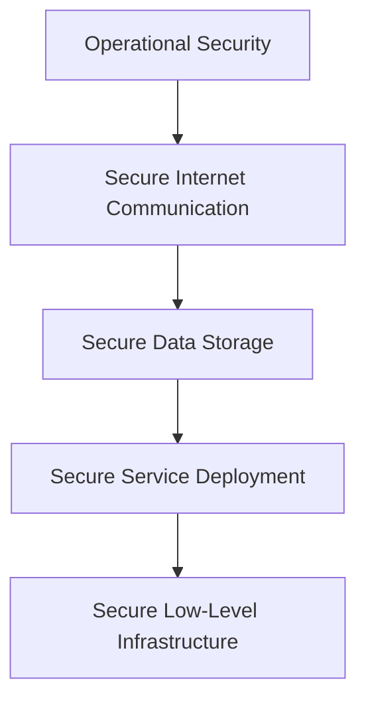

## 🔐 Google Cloud Security Architecture Overview

> [!summary] Google Cloud Architecture  
> Google’s cloud infrastructure is built on a multi-layered security model, designed to protect data from physical to application level.

### 1. 🧱 Secure Low-Level Infrastructure

- **Physical Security**
  - Camera surveillance
  - Metal detectors
  - Biometric identification
- **Hardware Identity**
  - Servers have unique IDs for authentication
- **Operational Automation**
  - Automated updates
  - Issue detection mechanisms

---

### 2. 🛡️ Secure Service Deployment

- **Zero-Trust Security Model**
  - All users, devices, and systems require authentication and authorization
- **Customer Data Isolation**
  - Ensures tenant separation in shared infrastructure

---

### 3. 🔐 Secure Data Storage

- **Encryption at Rest**
  - Protects against unauthorized access
- **Scheduled Data Deletion**
  - Prevents both accidental and malicious loss

---

### 4. 🌐 Secure Internet Communication

- **Private IP Addressing**
  - Infrastructure isolated from public internet
- **Credential-Based Access**
  - Authentication required for accessing cloud services

---

### 5. ⚙️ Operational Security

- **Code and Software Security**
  - Verified code libraries
  - Manual code security reviews
- **Device and Credential Protection**
  - Safeguarding employee hardware
  - Multi-factor authentication (MFA)
- **Threat Detection & Patching**
  - Active monitoring
  - Regular security updates and patch management

[[Security in the cloud (5 Layers).canvas|Security in the cloud (5 Layers)]]

---
# Defense In Depth (Based in [[NIST CSF 2.0]]

## Layered approach that uses multiple security control

* Identity Control: Measure that authenticates user before resource access (MFA)
* Protective Control: Protect access to resources and shields against malicious (AV, WAF, IaaC Policies)
* Network Controls: Firewalls, IPS
* Detective Controls: IDS, Cloud Security Command Center
* Responsive Controls: Actions after detection
* Recovery Controls: Actions after damage, like reverting to backups, 

