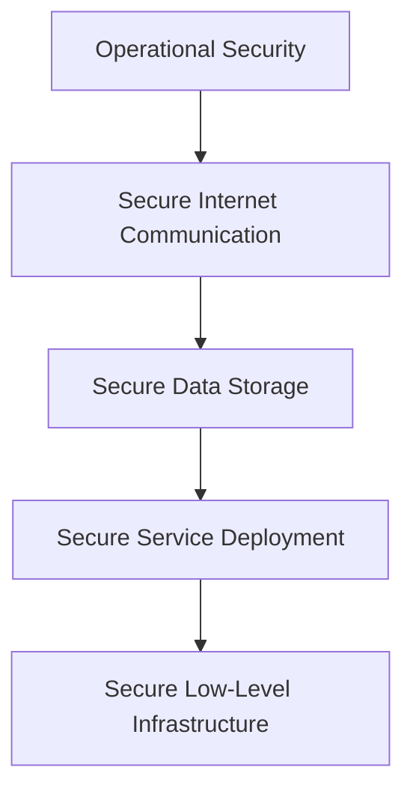

## 🔐 Google Cloud Security Architecture Overview

> [!summary] Google Cloud Architecture  
> Google’s cloud infrastructure is built on a multi-layered security model, designed to protect data from physical to application level.

### 1. 🏗️ Secure Low-Level Infrastructure

- **Physical Security**
  - Camera surveillance
  - Metal detectors
  - Biometric identification
- **Hardware Identity**
  - Servers have unique IDs for authentication
- **Operational Automation**
  - Automated updates
  - Issue detection mechanisms

---

### 2. 🛡️ Secure Service Deployment

- **Zero-Trust Security Model**
  - All users, devices, and systems require authentication and authorization
- **Customer Data Isolation**
  - Ensures tenant separation in shared infrastructure

---

### 3. 🔐 Secure Data Storage

- **Encryption at Rest**
  - Protects against unauthorized access
- **Scheduled Data Deletion**
  - Prevents both accidental and malicious loss

---

### 4. 🌐 Secure Internet Communication

- **Private IP Addressing**
  - Infrastructure isolated from public internet
- **Credential-Based Access**
  - Authentication required for accessing cloud services

---

### 5. ⚙️ Operational Security

- **Code and Software Security**
  - Verified code libraries
  - Manual code security reviews
- **Device and Credential Protection**
  - Safeguarding employee hardware
  - Multi-factor authentication (MFA)
- **Threat Detection & Patching**
  - Active monitoring
  - Regular security updates and patch management

[[Security in the cloud (5 Layers).canvas|Security in the cloud (5 Layers)]]

---
# 🧑‍🚒 Defense In Depth ([[NIST CSF 2.0|NIST Cybersecurity Framework]])

##### **Layered approach that uses multiple security control**

* Identity Control: Measure that authenticates user before resource access (MFA)
* Protective Control: Protect access to resources and shields against malicious (AV, WAF, IaaC Policies)
* Network Controls: Firewalls, IPS %% ------ > Not in NIST CSF Framework %%
* Detective Controls: IDS, Cloud Security Command Center
* Responsive Controls: Actions after detection
* Recovery Controls: Actions after damage, like reverting to backups, 

---

# 🪪 IAM and Cloud IAM
* Roles: Collection of permissions, policies and constrains to principals
* Principals: Users or Apps (Service Accounts) // Groups: Combine them depending on Org.
* Policies: Rules that allow/deny access.

##### **Federation**
Granting external identities access to your cloud environment. Like using SSO.
It is recommended to allow MFA to users using federation.

# 🧱 Firewall best practices 
Here are a few best practices you can apply when using firewalls: 
* Always use the principle of least privilege. When creating firewall rules, only allow necessary traffic to traverse the network. 
* Use hierarchical firewall policies, which will allow your organization to apply firewall policies to the organization and folder levels. Invoking hierarchical policy structure promotes consistency across organizational resources and the firewalls that protect them. 
* If your organization isn’t using their CSP’s firewall service, choose a FWaaS solution developed by a company that tailors their product to the specific CSP’s environment. There are many companies that provide FWaaS solutions to organizations.

---
## 🛡️ What is **Software Delivery Shield (SDS)**?

SDS is like a **security team + smart kitchen + camera system** built by Google Cloud to protect the software supply chain.

### SDS includes:

- ✅ **Secure workstations**: developers work in the cloud, not risky personal laptops
- 📜 **SBOMs (Software Bill of Materials)**: a list of everything used in your software — like a food label!
- 🔍 **Assured Open Source Software (OSS)**: only uses open-source tools that are verified and safe
- 🚦 **Dashboards**: show you if something’s wrong with your app’s security

---

## 🕒 What does **Shift Left** mean?

Usually, security is added at the **end**, like putting the lock on the pizza box after delivery.

But **shifting left** means putting **security at the beginning**:

- While you’re mixing ingredients
- While the chef is cooking
- While the kitchen is open

This helps catch problems **early** and fix them **faster**.

---

## 📦 In short:

> [!summary] Core Concept  
> The **software supply chain** is everything involved in making software.  
> **Software Delivery Shield** helps keep that process safe from start to finish — like a super clean, secure pizza kitchen in the cloud.