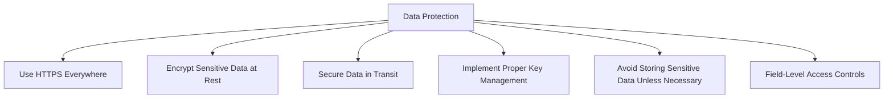
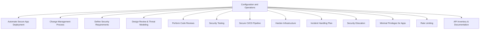
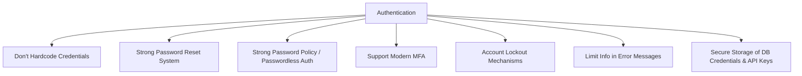
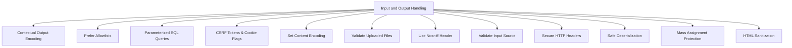
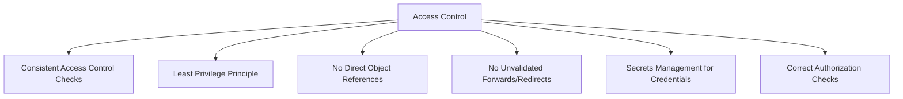

```mermaid
graph TD
    A[Session Management] --> B[Random Session Identifiers]
    A --> C[Regenerate Session Tokens]
    A --> D[Idle Session Timeout]
    A --> E[Absolute Session Timeout]
    A --> F[Destroy Tampered Sessions]
    A --> G[Invalidate on Logout]
    A --> H[Logout Button on Every Page]
    A --> I[Secure Cookie Attributes]
    A --> J[Set Cookie Domain & Path]
    A --> K[Set Cookie Expiration]
    A --> L[API Token Generation]
    A --> M[API Token Validation]
    A --> N[API Token Storage & Transmission]
    A --> O[Secure CORS Configuration]
```

> [!summary] Core Concept  
> Vulnerability Assessment involves identifying weaknesses in a system, while Hardening refers to reducing its attack surface by remediating those weaknesses. Together, they form a critical defense and recon step in ethical hacking.

[[NIST NVD]]
[[VulDB]]
[[OWASP Top 10]]

### 🕵️‍♂️ Vulnerability Assessment

The goal is to **scan systems, services, and configurations** to detect known vulnerabilities that an attacker might exploit.

#### 🔧 Common Tools

| Tool                  | Description                                                                  |
| --------------------- | ---------------------------------------------------------------------------- |
| **OpenVAS / GVM**     | Full-featured open-source scanner with regular CVE database updates.         |
| **Nessus Essentials** | Free for up to 16 IPs; widely used in professional environments.             |
| **Lynis**             | Lightweight auditing and hardening tool for Unix-based systems.              |
| **Nikto**             | Scans web servers for outdated versions, risky files, and misconfigurations. |
| **[[Nmap]] + NSE**    | Powerful port scanner with scripting engine for basic vuln detection.        |

> [!tip] Helpful Tip  
> Run scans both *authenticated* (logged in) and *unauthenticated* for deeper insight.

---

### 🛡️ System Hardening

Once vulnerabilities are identified, **hardening** aims to remove or mitigate them through configuration changes and security practices.

#### 📋 Techniques

- Disable unused services and ports.
- Apply all system and package updates.
- Enforce strong password and authentication policies.
- Configure firewalls (e.g., `ufw`, `iptables`).
- Set proper file and directory permissions.
- Enable logging and auditing (e.g., `auditd`).

#### 🧰 Hardening Tools

- **Lynis** – also provides hardening recommendations.
- **Debsecan** – shows known vulnerabilities for installed Debian packages.
- **chkrootkit / rkhunter** – check for rootkits.
- **CIS Benchmarks** – security best practices per OS.

---

### 🔁 Workflow Example (Mermaid)

```mermaid
flowchart TD
    A[Recon & Enumeration] --> B[Run Vulnerability Scanner]
    B --> C[Analyze CVE Results]
    C --> D[Prioritize Fixes]
    D --> E[Apply Hardening Steps]
    E --> F[Re-scan & Validate]
````

> [!info] Did You Know?  
> Continuous hardening is a key part of **[[Google Cloud Security Architecture#🧑‍🚒 Defense In Depth ( NIST CSF 2.0 NIST Cybersecurity Framework )|defense-in-depth]]**, especially when paired with Command & Control detection and Defense Evasion mitigation.

---
# 🔐 Security Checklist for Web Applications

## Introduction to CWE and MITRE

The Common Weakness Enumeration (CWE) is a community-developed list of software and hardware weakness types maintained by MITRE, a not-for-profit organization that operates Federally Funded Research and Development Centers (FFRDCs) in the U.S.

- **CWE** provides a common language for describing software security weaknesses.
- It helps developers, testers, and security professionals identify and mitigate vulnerabilities early in the software development lifecycle.
- **MITRE** supports this effort by curating and updating the CWE list, ensuring it reflects current threats and industry practices.

---

## SANS Institute and the SWAT Checklist

The SANS Institute is a trusted authority in cybersecurity training and certification. One of their key contributions to web application security is the **SWAT (Securing Web Application Technologies) Checklist** https://www.sans.org/cloud-security/securing-web-application-technologies/

- The **SWAT Checklist** is a practical guide for developers and security teams.
- It outlines best practices across critical areas such as:
    - Authentication
    - Session Management
    - Input Validation
    - Access Control
    - Logging and Monitoring
    - Error Handling
    - Data Protection

You can explore the full checklist [here](https://www.sans.org/cloud-security/securing-web-application-technologies/).

---

## Summary of SWAT Checklist Categories

### 🛠️ Error Handling and Logging

#### 📊 Mermaid Diagram

```mermaid
graph TD
    A[Error Handling and Logging] --> B[Display Generic Error Messages]
    A --> C[No Unhandled Exceptions]
    A --> D[Suppress Framework Generated Errors]
    A --> E[Log All Authentication Activities]
    A --> F[Log All Privilege Changes]
    A --> G[Log Administrative Activities]
    A --> H[Log Access to Sensitive Data]
    A --> I[Do Not Log Inappropriate Data]
    A --> J[Active Security Monitoring]
    A --> K[Store Logs Securely]
```

#### 📋 Table Summary

|Best Practice|Description|CWE ID|
|---|---|---|
|Display Generic Error Messages|Avoid exposing internal application details like file paths or stack traces in error messages.|CWE-209|
|No Unhandled Exceptions|Ensure all exceptions are caught and handled gracefully to prevent application crashes and information leakage.|CWE-391|
|Suppress Framework Errors|Replace default framework error messages with custom ones to avoid leaking sensitive information.|CWE-209|
|Log All Authentication Activities|Record login attempts, token events, and failed authentications with metadata like IP and device info.|CWE-778|
|Log All Privilege Changes|Track any changes in user privilege levels.|CWE-778|
|Log Administrative Activities|Log all administrative actions across the application and its components.|CWE-778|
|Log Access to Sensitive Data|Record access to sensitive data, especially for compliance with regulations like HIPAA, PCI, or SOX.|CWE-778|
|Do Not Log Inappropriate Data|Avoid logging sensitive data in plaintext; encrypt logs if necessary to meet compliance and reduce risk.|CWE-532|
|Active Security Monitoring|Use centralized logging (e.g., SIEM), cryptographic validation, and automated threat detection with alerting and response protocols.|CWE-778|
|Store Logs Securely|Protect logs from tampering or loss, and follow retention policies for forensic and compliance purposes.|CWE-533|

---
### 🔒 Data Protection

#### 📊 Mermaid Diagram



#### 📋 Table Summary

|Best Practice|Description|CWE ID(s)|
|---|---|---|
|Use HTTPS Everywhere|Use HTTPS across the entire application, especially for authentication and sensitive data transmission.|CWE-311, CWE-319, CWE-523|
|Encrypt Sensitive Data at Rest|Encrypt stored sensitive data using strong algorithms to prevent unauthorized access.|CWE-311|
|Secure Data in Transit|Use TLS or similar protocols to encrypt sensitive data during transmission.|CWE-319|
|Implement Proper Key Management|Securely manage encryption keys with rotation, access control, and separation by environment or data type.|CWE-320|
|Avoid Storing Sensitive Data|Minimize storage of sensitive data; encrypt and restrict access when storage is necessary.|CWE-312|
|Field-Level Access Controls|Enforce access controls at the field level in APIs, using attribute-based policies and server-side filtering to prevent unauthorized data exposure.|CWE-213, CWE-285|

---
### ⚙️ Configuration and Operations

#### 📊 Mermaid Diagram



#### 📋 Table Summary

|Best Practice|Description|CWE ID(s)|
|---|---|---|
|Automate Secure App Deployment|Use CI/CD pipelines with integrated security checks (SAST, DAST, SCA, secrets scanning, etc.) for consistent and secure deployments.|—|
|Change Management Process|Enforce a rigorous process for managing and approving changes before deployment.|CWE-439|
|Define Security Requirements|Collaborate with stakeholders to define functional and non-functional security requirements early in the development lifecycle.|—|
|Design Review & Threat Modeling|Conduct threat modeling and design reviews to identify and mitigate risks before development begins.|CWE-701, CWE-656|
|Perform Code Reviews|Regularly review code for security flaws such as injection and XSS vulnerabilities.|CWE-702|
|Security Testing|Perform security testing during and after development, especially after major updates.|—|
|Secure CI/CD Pipeline|Protect the CI/CD pipeline with access controls, secrets management, and integrity checks to prevent tampering.|CWE-94, CWE-284|
|Harden Infrastructure|Apply hardening guidelines to all infrastructure components and use tools like WAFs and API gateways.|CWE-15, CWE-656|
|Incident Handling Plan|Develop and regularly test a plan for responding to security incidents, with clear roles and contacts.|—|
|Security Education|Provide ongoing security training for all roles involved in the development process.|—|
|Minimal Privileges for Apps|Run applications and middleware with the least privileges necessary to reduce impact if compromised.|CWE-250|
|Rate Limiting|Implement tiered rate limits, progressive throttling, and circuit breakers to protect backend services.|CWE-770, CWE-307, CWE-400|
|API Inventory & Documentation|Maintain a complete, documented inventory of APIs with ownership, classification, and security requirements.|CWE-1059|

---

### 🔐 Authentication

#### 📊 Mermaid Diagram



#### 📋 Table Summary

|Best Practice|Description|CWE ID(s)|
|---|---|---|
|Don't Hardcode Credentials|Avoid embedding credentials in source code. Use secure secrets management solutions instead.|CWE-798|
|Strong Password Reset System|Use secure, non-guessable reset mechanisms and avoid revealing account existence through reset flows.|CWE-640|
|Strong Password Policy / Passwordless Auth|Enforce strong password rules or adopt passwordless methods like FIDO2 or push-based authenticators.|CWE-521|
|Support Modern MFA|Implement phishing-resistant MFA (e.g., FIDO-based passkeys) for sensitive or admin accounts.|CWE-308|
|Account Lockout Mechanisms|Prevent brute force and credential stuffing with lockouts, rate limiting, and behavioral analysis.|CWE-307|
|Limit Info in Error Messages|Avoid revealing whether a username or password is incorrect to prevent account enumeration.|—|
|Secure Storage of DB Credentials & API Keys|Store credentials in centralized, secure locations (e.g., secrets managers), not in code or config files.|CWE-257|

---

### 🧾 Session Management

#### 📊 Mermaid Diagram



#### 📋 Table Summary

|Best Practice|Description|CWE ID(s)|
|---|---|---|
|Random Session Identifiers|Use secure random functions to generate unpredictable session tokens.|CWE-6|
|Regenerate Session Tokens|Regenerate tokens on login, privilege changes, or encryption status changes to prevent fixation.|CWE-384|
|Idle Session Timeout|Automatically log out users after inactivity to reduce hijacking risk.|CWE-613|
|Absolute Session Timeout|Enforce logout after a fixed time period regardless of activity.|CWE-613|
|Destroy Tampered Sessions|Detect and destroy cloned or tampered sessions to force re-authentication.|—|
|Invalidate on Logout|Fully destroy session data on logout to prevent reuse.|CWE-613|
|Logout Button on Every Page|Provide easy access to logout functionality on all authenticated pages.|—|
|Secure Cookie Attributes|Use `HttpOnly`, `Secure`, and `SameSite` flags to protect session cookies.|CWE-79, CWE-614, CWE-1004|
|Set Cookie Domain & Path|Restrict cookie scope to the minimal required domain and path.|—|
|Set Cookie Expiration|Avoid non-expiring cookies; set reasonable expiration times.|—|
|API Token Generation|Use standards like OAuth2/JWT with secure algorithms and short-lived tokens.|CWE-330|
|API Token Validation|Validate token signatures and claims; implement rotation and revocation.|CWE-347|
|API Token Storage & Transmission|Transmit via `Authorization` headers; store securely using HttpOnly cookies or platform-specific secure storage.|CWE-598|
|Secure CORS Configuration|Use strict CORS policies with allowlists and avoid wildcards for sensitive data.|CWE-346|

---
### 🧮 Input and Output Handling

#### 📊 Mermaid Diagram



#### 📋 Table Summary

|Best Practice|Description|CWE ID(s)|
|---|---|---|
|Contextual Output Encoding|Encode output based on its context (HTML, JS, URL) to prevent XSS.|CWE-79|
|Prefer Allowlists|Validate input using allowlists; blocklists are secondary.|CWE-159, CWE-144|
|Parameterized SQL Queries|Use bind variables to prevent SQL injection; avoid dynamic query construction.|CWE-89, CWE-564|
|CSRF Tokens & Cookie Flags|Use CSRF tokens and secure cookie attributes to prevent forged requests.|CWE-352|
|Set Content Encoding|Define encoding (e.g., UTF-8) via headers or meta tags to prevent XSS.|CWE-172|
|Validate Uploaded Files|Check file size, type, content, and path to prevent malicious uploads.|CWE-434, CWE-616, CWE-22|
|Use Nosniff Header|Prevent MIME type sniffing by setting `X-Content-Type-Options: nosniff`.|CWE-430|
|Validate Input Source|Accept input only from expected sources (e.g., POST vs GET).|CWE-20, CWE-346|
|Secure HTTP Headers|Use headers like `X-Frame-Options` to prevent clickjacking; add framebusting JS for older browsers.|CWE-79, CWE-692|
|Safe Deserialization|Avoid insecure deserialization; use safe formats and restrict object types.|CWE-502|
|Mass Assignment Protection|Prevent overposting by restricting which fields can be updated.|CWE-915|
|HTML Sanitization|Sanitize user-generated HTML to prevent XSS in rich content.|CWE-79|

---

### 🛡️ Access Control

#### 📊 Mermaid Diagram



#### 📋 Table Summary

|Best Practice|Description|CWE ID(s)|
|---|---|---|
|Consistent Access Control Checks|Enforce access control on every request through a centralized mechanism.|CWE-284|
|Least Privilege Principle|Grant only the minimum necessary permissions to users and services.|CWE-272, CWE-250|
|No Direct Object References|Avoid exposing internal references (e.g., file names, IDs) directly to users; validate access server-side.|CWE-284|
|No Unvalidated Forwards/Redirects|Validate all redirects and forwards to prevent unauthorized access or phishing.|CWE-601|
|Secrets Management for Credentials|Use centralized secrets management tools to securely store and manage API keys and credentials.|CWE-522|
|Correct Authorization Checks|Ensure users can only access resources and perform actions they are authorized for, down to the field level.|CWE-285|

---

## Full Map

``` mermaid
graph TD
    A[SWAT Checklist Categories] --> B[Error Handling and Logging]
    A --> C[Access Control]
    A --> D[Data Protection]
    A --> E[Configuration and Operations]
    A --> F[Authentication]
    A --> G[Session Management]
    A --> H[Input and Output Handling]

    subgraph Error Handling and Logging
        B1[Display Generic Error Messages]
        B2[No Unhandled Exceptions]
        B3[Suppress Framework Generated Errors]
        B4[Log All Authentication Activities]
        B5[Log All Privilege Changes]
        B6[Log Administrative Activities]
        B7[Log Access to Sensitive Data]
        B8[Do Not Log Inappropriate Data]
        B9[Active Security Monitoring]
        B10[Store Logs Securely]
        B --> B1
        B --> B2
        B --> B3
        B --> B4
        B --> B5
        B --> B6
        B --> B7
        B --> B8
        B --> B9
        B --> B10
    end

    subgraph Access Control
        C1[Consistent Access Control Checks]
        C2[Least Privilege Principle]
        C3[No Direct Object References]
        C4[No Unvalidated Forwards/Redirects]
        C5[Secrets Management for Credentials]
        C6[Correct Authorization Checks]
        C --> C1
        C --> C2
        C --> C3
        C --> C4
        C --> C5
        C --> C6
    end

    subgraph Data Protection
        D1[Use HTTPS Everywhere]
        D2[Encrypt Sensitive Data at Rest]
        D3[Secure Data in Transit]
        D4[Implement Proper Key Management]
        D5[Avoid Storing Sensitive Data Unless Necessary]
        D6[Field-Level Access Controls]
        D --> D1
        D --> D2
        D --> D3
        D --> D4
        D --> D5
        D --> D6
    end

    subgraph Configuration and Operations
        E1[Automate Secure App Deployment]
        E2[Change Management Process]
        E3[Define Security Requirements]
        E4[Design Review & Threat Modeling]
        E5[Perform Code Reviews]
        E6[Security Testing]
        E7[Secure CI/CD Pipeline]
        E8[Harden Infrastructure]
        E9[Incident Handling Plan]
        E10[Security Education]
        E11[Minimal Privileges for Apps]
        E12[Rate Limiting]
        E13[API Inventory & Documentation]
        E --> E1
        E --> E2
        E --> E3
        E --> E4
        E --> E5
        E --> E6
        E --> E7
        E --> E8
        E --> E9
        E --> E10
        E --> E11
        E --> E12
        E --> E13
    end

    subgraph Authentication
        F1[Don't Hardcode Credentials]
        F2[Strong Password Reset System]
        F3[Strong Password Policy / Passwordless Auth]
        F4[Support Modern MFA]
        F5[Account Lockout Mechanisms]
        F6[Limit Info in Error Messages]
        F7[Secure Storage of DB Credentials & API Keys]
        F --> F1
        F --> F2
        F --> F3
        F --> F4
        F --> F5
        F --> F6
        F --> F7
    end

    subgraph Session Management
        G1[Random Session Identifiers]
        G2[Regenerate Session Tokens]
        G3[Idle Session Timeout]
        G4[Absolute Session Timeout]
        G5[Destroy Tampered Sessions]
        G6[Invalidate on Logout]
        G7[Logout Button on Every Page]
        G8[Secure Cookie Attributes]
        G9[Set Cookie Domain & Path]
        G10[Set Cookie Expiration]
        G11[API Token Generation]
        G12[API Token Validation]
        G13[API Token Storage & Transmission]
        G14[Secure CORS Configuration]
        G --> G1
        G --> G2
        G --> G3
        G --> G4
        G --> G5
        G --> G6
        G --> G7
        G --> G8
        G --> G9
        G --> G10
        G --> G11
        G --> G12
        G --> G13
        G --> G14
    end

    subgraph Input and Output Handling
        H1[Contextual Output Encoding]
        H2[Prefer Allowlists]
        H3[Parameterized SQL Queries]
        H4[CSRF Tokens & Cookie Flags]
        H5[Set Content Encoding]
        H6[Validate Uploaded Files]
        H7[Use Nosniff Header]
        H8[Validate Input Source]
        H9[Secure HTTP Headers]
        H10[Safe Deserialization]
        H11[Mass Assignment Protection]
        H12[HTML Sanitization]
        H --> H1
        H --> H2
        H --> H3
        H --> H4
        H --> H5
        H --> H6
        H --> H7
        H --> H8
        H --> H9
        H --> H10
        H --> H11
        H --> H12
    end
```



---
```mermaid
mindmap

  root((mindmap))

    Origins

      Long history

      ::icon(fa fa-book)

      Popularisation

        British popular psychology author Tony Buzan

    Research

      On effectiveness<br/>and features

      On Automatic creation

        Uses

            Creative techniques

            Strategic planning

            Argument mapping

    Tools

      Pen and paper

      Mermaid
```