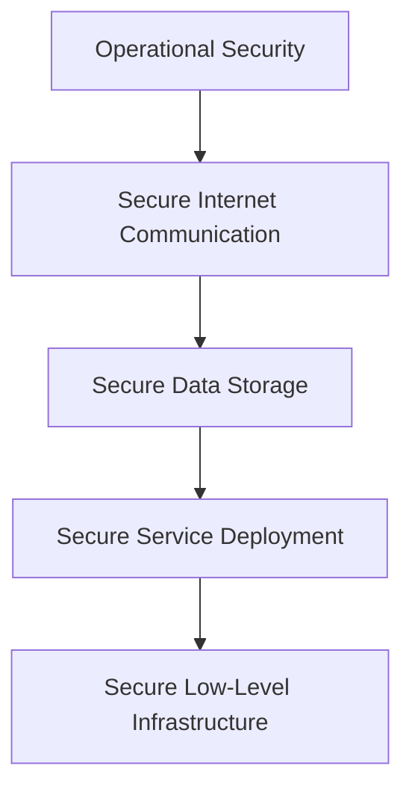
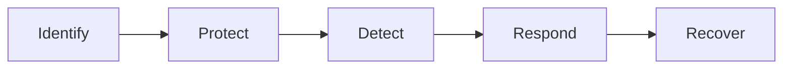
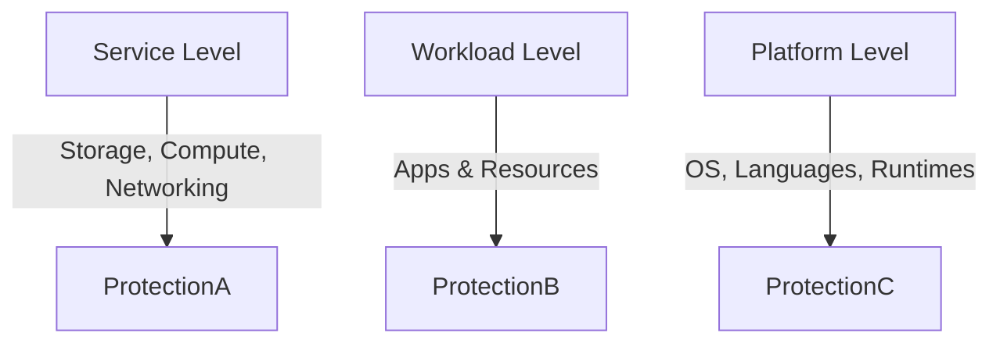
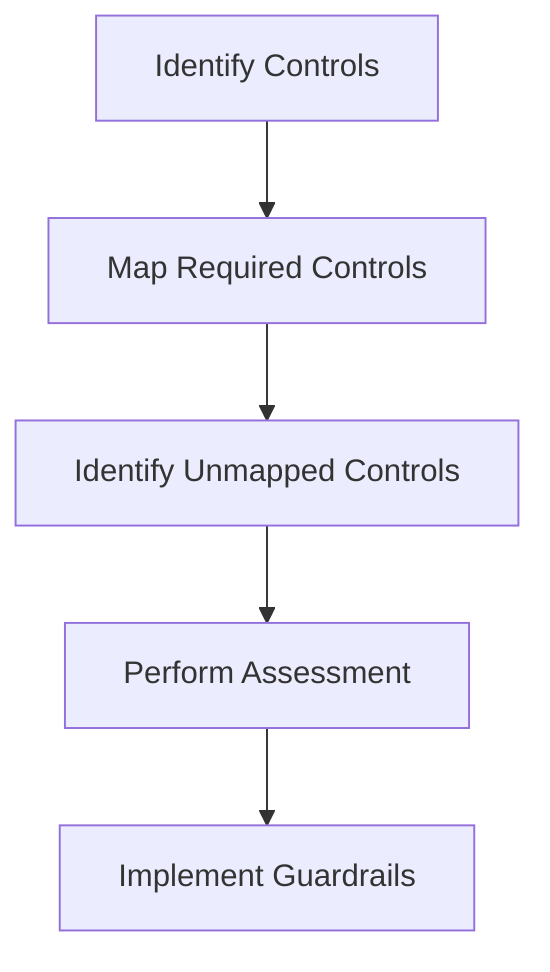
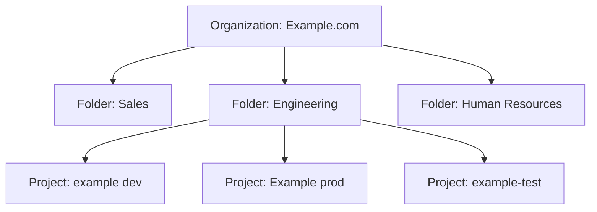

# Google Cloud Security Architecture Overview

> [!summary] Google Cloud Architecture  
> Google’s cloud infrastructure is built on a multi-layered security model, designed to protect data from physical to application level.


## 🔐 Security Architecture Overview
### 1. 🏗️ Secure Low-Level Infrastructure

- **Physical Security**
  - Camera surveillance
  - Metal detectors
  - Biometric identification
- **Hardware Identity**
  - Servers have unique IDs for authentication
- **Operational Automation**
  - Automated updates
  - Issue detection mechanisms

---

### 2. 🛡️ Secure Service Deployment

- **Zero-Trust Security Model**
  - All users, devices, and systems require authentication and authorization
- **Customer Data Isolation**
  - Ensures tenant separation in shared infrastructure

---

### 3. 🔐 Secure Data Storage

- **Encryption at Rest**
  - Protects against unauthorized access
- **Scheduled Data Deletion**
  - Prevents both accidental and malicious loss

---

### 4. 🌐 Secure Internet Communication

- **Private IP Addressing**
  - Infrastructure isolated from public internet
- **Credential-Based Access**
  - Authentication required for accessing cloud services

---

### 5. ⚙️ Operational Security

- **Code and Software Security**
  - Verified code libraries
  - Manual code security reviews
- **Device and Credential Protection**
  - Safeguarding employee hardware
  - Multi-factor authentication (MFA)
- **Threat Detection & Patching**
  - Active monitoring
  - Regular security updates and patch management




[[Security in the cloud (5 Layers).canvas|Security in the cloud (5 Layers)]]

---
## Sovereign Clouds

> [!definition]
> **Sovereign Cloud**  
> A cloud setup confined to a specific country or region, ensuring data handling complies with local privacy laws.

## Key Points

- Ensures national laws govern data access and processing.
- Supports national security by keeping sensitive data (e.g., healthcare) local.
- Enables digital sovereignty for governments.
- Adds cost and complexity for global organizations.

> [!warning]
> Non-compliance may result in being barred from operating in that region.

---
## 🧑‍🚒 Defense In Depth ([[NIST CSF 2.0|NIST Cybersecurity Framework]])

### **Layered approach that uses multiple security control**

* Identity Control: Measure that authenticates user before resource access (MFA)
* Protective Control: Protect access to resources and shields against malicious (AV, WAF, IaaC Policies)
* Network Controls: Firewalls, IPS %% ------ > Not in NIST CSF Framework %%
* Detective Controls: IDS, Cloud Security Command Center
* Responsive Controls: Actions after detection
* Recovery Controls: Actions after damage, like reverting to backups, 

---

## 🪪 [[Identity & Access Management (IAM)|IAM]] and Cloud IAM
* Roles: Collection of permissions, policies and constrains to principals
* Principals: Users or Apps (Service Accounts) // Groups: Combine them depending on Org.
* Policies: Rules that allow/deny access.

### **Federation**
Granting external identities access to your cloud environment. Like using SSO.
It is recommended to allow MFA to users using federation.

## 🧱 Firewall best practices 
Here are a few best practices you can apply when using firewalls: 
* Always use the principle of least privilege. When creating firewall rules, only allow necessary traffic to traverse the network. 
* Use hierarchical firewall policies, which will allow your organization to apply firewall policies to the organization and folder levels. Invoking hierarchical policy structure promotes consistency across organizational resources and the firewalls that protect them. 
* If your organization isn’t using their CSP’s firewall service, choose a FWaaS solution developed by a company that tailors their product to the specific CSP’s environment. There are many companies that provide FWaaS solutions to organizations.

---
## 🛡️ What is **Software Delivery Shield (SDS)**?

SDS is like a **security team + smart kitchen + camera system** built by Google Cloud to protect the software supply chain.

### SDS includes:

- ✅ **Secure workstations**: developers work in the cloud, not risky personal laptops
- 📜 **SBOMs (Software Bill of Materials)**: a list of everything used in your software — like a food label!
- 🔍 **Assured Open Source Software (OSS)**: only uses open-source tools that are verified and safe
- 🚦 **Dashboards**: show you if something’s wrong with your app’s security

---

## 🕒 What does **Shift Left** mean?

Usually, security is added at the **end**, like putting the lock on the pizza box after delivery.

But **shifting left** means putting **security at the beginning**:

- While you’re mixing ingredients
- While the chef is cooking
- While the kitchen is open

This helps catch problems **early** and fix them **faster**.

---
## 📦 In short:

> [!summary] Core Concept  
> The **software supply chain** is everything involved in making software.  
> **Software Delivery Shield** helps keep that process safe from start to finish — like a super clean, secure pizza kitchen in the cloud.

---
# Google Cloud NIST CSF Alignment

> [!info]  
> This note aligns cloud tools with the five pillars of the **NIST Cybersecurity Framework (CSF)**: Identify, Protect, Detect, Respond, and Recover.

## 🧱 NIST CSF Pillars Overview



---

## 🕵️ Identify

|Tool|Description|
|---|---|
|IAM|Role-based access control; bind roles to groups for easier management.|
|Cloud Asset Inventory|35-day time-series inventory of GCP assets.|
|Cloud Identity|Centralized user/group management via IDaaS.|
|SCC (Identify)|Asset discovery, inventory, and vulnerability scans.|

> [!tip]  
> Use Cloud Asset Inventory with IAM to track access and ensure least-privilege access.

---

## 🛡️ Protect

|Tool|Purpose|
|---|---|
|Cloud IDS|Detects network-level intrusions and threats.|
|reCAPTCHA Enterprise|Prevents bots using adaptive challenges.|
|Cloud Armor|Defends against DDoS and web application attacks.|
|BeyondCorp Enterprise|Enforces contextual security policies.|
|Identity-Aware Proxy|Implements app-level access control.|
|Two-Factor Auth (2FA)|Adds hardware/software-based secondary authentication.|
|Service Controls|Prevents data exfiltration within GCP.|
|Zero Trust|Validates all access, regardless of origin.|
|SCC (Protect module)|Detects threats and enforces security posture.|

> [!warning]  
> Adopt a zero-trust model — assume breach and continuously validate access.

---

## 🔍 Detect

|Tool|Functionality|
|---|---|
|Cloud Logging|Real-time log collection and alerting.|
|Cloud Monitoring|Observability and alerting for multicloud/hybrid environments.|
|SCC (Detect module)|Consolidates threat detection and custom rule definitions.|
|Chronicle SIEM|Aggregates and analyzes security events in real-time.|

> [!example]  
> Use Cloud Logging to alert when service accounts are accessed outside business hours.

---

## 🧯 Respond

|Tool|Role in Incident Response|
|---|---|
|Chronicle SOAR|Automates and orchestrates threat response workflows.|
|Mandiant|Provides forensic analysis, breach investigation, and remediation.|

> [!tip]  
> Combine Chronicle SIEM with SOAR to automate detection-to-response pipelines.

---

## 🔄 Recover

|Tool|Capability|
|---|---|
|Backup & Restore|Manages incremental backups across all workloads.|
|Actifio Go|Supports granular, app-aware, and bare-metal recovery.|
|Cyber Insurance|Covers financial and legal aspects of recovery from breaches.|

> [!note]  
> Test recovery processes regularly to ensure backup integrity and response readiness.

---

## 🧠 Key Takeaways

> [!summary]
> 
> - Use the NIST CSF to guide tool adoption and security maturity.
>     
> - Map tools like SCC and Chronicle across multiple pillars.
>     
> - Implement layered defenses, automate responses, and maintain tested recovery plans.
>     

---

## 📚 Resources

- [NIST Cybersecurity Framework](https://www.nist.gov/cyberframework)
- [Google Cloud Security](https://cloud.google.com/security)


# Cloud Security Controls

## Types of Cloud Security Controls

> [!info] Classification  
> Cloud security controls are mechanisms that support risk reduction through layered defense and targeted mitigation across digital assets.

|Control Type|Purpose|Example|
|---|---|---|
|**Deterrent**|Deter attackers psychologically or informatively|Passphrases that are harder to crack than traditional passwords|
|**Preventative**|Strengthen and proactively secure assets|Disabling unused ports to reduce attack surfaces|
|**Corrective**|Mitigate damage after incidents|Scripts that repair damage and notify admins after unauthorized actions|
|**Detective**|Identify and report ongoing or past attacks|Antivirus software, monitoring tools|
|**Compensating**|Fill gaps where standard controls can't be applied|Deadbolt added to a locked door handle|

---

## Levels of Application

> [!tip] Multi-Layered Protection  
> Controls should be applied at various operational levels to ensure robust security posture.



- **Service Level:** Infrastructure components like storage and networking.
- **Workload Level:** Business applications and their supporting resources.
- **Platform Level:** Operating environments such as OSes and programming runtimes.

---

## Control Mapping Process

> [!important] Control Governance Lifecycle  
> A well-structured mapping process ensures security controls align with organizational and regulatory requirements.



1. **Identify Controls** – Inventory existing security controls within the cloud environment.
2. **Map Required Controls** – Align existing controls to frameworks like NIST, CIS, or ISO.
3. **Identify Unmapped Controls** – Detect gaps where existing controls do not meet compliance or policy standards.
4. **Perform Assessment** – Evaluate effectiveness and sufficiency of mapped controls.
5. **Implement Guardrails** – Apply policy initiatives via native cloud tools or third-party solutions.

---



---


# Google Security Command Center (SCC)

> [!info]  
> **Google Security Command Center (SCC)** is Google's CSPM (Cloud Security Posture Management) platform for managing security and compliance across multi-cloud environments.

## Key Capabilities

- Alignment with **CIS Google Cloud Computing Foundations Benchmark**
- **Asset inventory and tracking**
- **Real-time notifications** for security events
- **Misconfiguration identification** for cloud resources

## Core Services

### 1. Security Health Analytics

> [!tip]  
> Automatically identifies misconfigured resources and vulnerabilities across your GCP environment.

- Analyzes virtual machines, containers, networks, storage buckets, and IAM policies
- Detects vulnerabilities and suggests remediations

### 2. Web Security Scanner

> [!example]  
> Useful for web app vulnerability detection in environments like App Engine and GKE.

- **Managed Scans**: Basic scans configured by SCC
- **Custom Scans**: Granular scans with custom configuration
- **Container Threat Detection**: Monitors GKE containers for signs of compromise
- **Virtual Machine Threat Detection**: Detects potentially malicious apps in Compute Engine VMs

### 3. Compliance Dashboard

> [!note]  
> Supports tracking compliance posture and exporting audit-ready reports.

- Framework violation checks
- Fix recommendations
- Exportable compliance reports (e.g., for PCI, CIS)

### 4. Integrated Data Sources

- **Cloud Armor**: Protects against DDoS and OWASP threats
- **Sensitive Data Protection**: Scans buckets and databases for regulated data
- **SCC Partner Integrations**: Extends capabilities via third-party security tools

---
## Google Security Command Center (SCC) Tiers

```mermaid
graph TD
  %% Tiers
  A[Standard Tier]
  
  %% Standard Tier Features
  A --> B[Security Health Analytics]
  A --> C[High-Severity Threat Detection]

   %% Styling
  classDef tier fill:#cce5ff,stroke:#004085,stroke-width:2px;
  classDef feature fill:#f8f9fa,stroke:#6c757d,stroke-width:1px;
  class A,D tier;
  class B,C,E,F,G,H,I feature;

  ```
  
```mermaid
graph TD
  %% Tiers
  D[Premium Tier - Standard Tier + ]

  %% Premium Tier Features
  D --> E[PCI and CIS Benchmark Reporting]
  D --> F[Web Security Scanner]
  D --> G[Event Threat Detection]
  D --> H[Container Threat Detection]
  D --> I[VM Threat Detection]

  %% Styling
  classDef tier fill:#cce5ff,stroke:#004085,stroke-width:2px;
  classDef feature fill:#f8f9fa,stroke:#6c757d,stroke-width:1px;
  class A,D tier;
  class B,C,E,F,G,H,I feature;

  ```

---

# Google Cloud Security Tools 

> [!info] Focus  
> This summary outlines key cloud-native tools in Google Cloud's Security Command Center (SCC) for managing risk and compliance.

### Risk Manager

|Feature|Description|
|---|---|
|**Purpose**|Risk assessment and reporting|
|**Integration**|Aggregates data from SCC, Cloud Asset Inventory, and more|
|**Benchmarking**|Aligns with CIS Google Cloud Foundations Benchmark|
|**Report Use Cases**|Shared with cyber insurers to determine appropriate insurance coverage|
|**Automation**|Reports can be generated on-demand or scheduled (daily, weekly, monthly)|

### Policy Analyzer

|Feature|Description|
|---|---|
|**Purpose**|Reviews IAM policies and enforces least-privilege access|
|**Output**|Role-binding reports with conditions and access principals|
|**Query Scope**|Customizable across orgs, projects, or folders|
|**Export Options**|Results can be written to BigQuery or Cloud Storage|

### Assured Workloads

| Feature                       | Description                                                                          |
| ----------------------------- | ------------------------------------------------------------------------------------ |
| **Purpose**                   | Ensures workloads meet industry compliance standards                                 |
| **Compliance Templates**      | Predefined configurations for healthcare, government, etc.                           |
| **Data Residency Controls**   | Restricts storage to specified geographic regions                                    |
| **Personnel Access Controls** | Limits access to authorized Google personnel based on physical and vetting standards |
| **Encryption**                | Defaults to encryption at rest and in transit; supports customer-managed keys        |
| **Monitoring**                | Alerts on policy changes that break compliance                                       |
| **Multi-Framework Support**   | Supports multiple compliance programs for multinational needs                        |

---

# 🔐 HMAC-Based Authentication in Cloud APIs

> HMAC-based (or signature-based) authentication is widely used in cloud services like **AWS S3**, **Google Cloud Storage**, and others.

## 📌 Key Concepts

- The **servers and clients do not store the password (secret key) in plaintext**.
- Instead, they uses the **secret key to generate a cryptographic signature** (e.g., `HMAC-SHA256`) over the request.
- This **signature is sent along with authentication request**.
- The **other end verifies the signature** using the known secret key.

> [!note]  
> The secret key is never sent over the network, but it must be accessible to the client to generate the signature.

---

## 🔄 Why the Secret Key Must Be Stored on the Client

> [!warning] 
> You can't just store a hash of the secret key!

- Hashes like `SHA256` are **one-way** — they cannot be reversed.
- To compute an HMAC, you need the **original secret key**, not its hash.
- Therefore, the client must **store the secret key securely**, even if not in plaintext.

---

## ✅ Secure Storage Options for Secret Keys

| Method              | Description                                                                         |
| ------------------- | ----------------------------------------------------------------------------------- |
| **Secrets Manager** | Centralized service (e.g., Lockboxes) for managing and rotating secrets.            |
| **TPM / HSM**       | Hardware-based secure storage (Trusted Platform Module / Hardware Security Module). |
| **Encrypted Files** | Encrypted configuration files (e.g., `ComponentCredentials.xml`).                   |

---

## ❓ When Is the System Passphrase Used?

> [!info] 
> The system passphrase plays a critical role in Servers components.

- Acts as a **primary key** for:
    - File system encryption
    - Cloud access
    - Certificate management
    - Boost tokens
    - System configuration in scale-out environments
    - Licensing information


---
_**Penguinified by [https://chatgpt.com/g/g-683f4d44a4b881919df0a7714238daae-penguinify](https://chatgpt.com/g/g-683f4d44a4b881919df0a7714238daae-penguinify)
