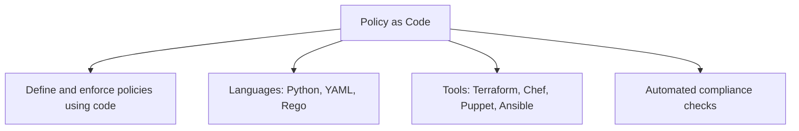
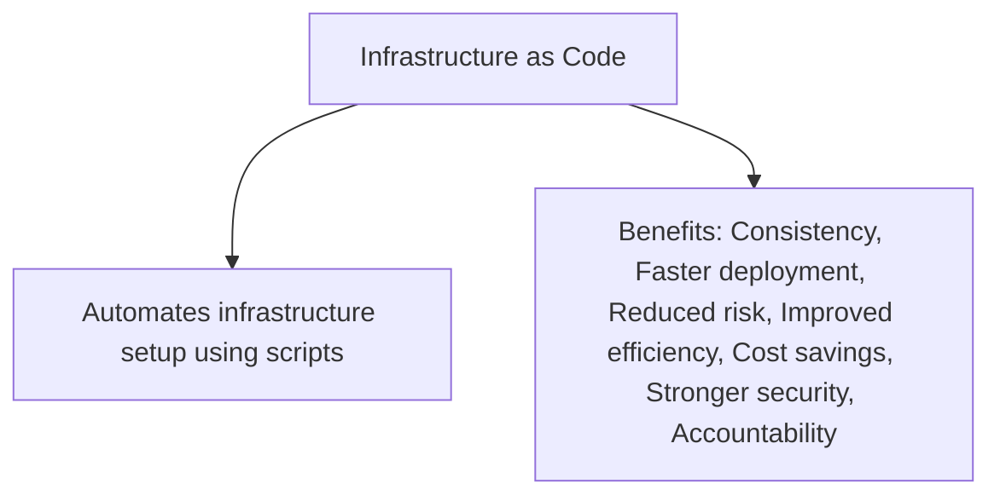

# 🛠️ Infrastructure as Code (IaC)?

> [!summary] Core Concept  
Infrastructure as Code (IaC) automates the provisioning and management of cloud infrastructure using reusable scripts, making it a powerful tool in the DevSecOps workflow.

IaC replaces manual infrastructure setup with automated scripts that define the desired system state (declarative model) with tools like [[Terraform]]. This makes environments consistent, scalable, and secure.

## 🧩 What is Infrastructure as Code?

Infrastructure as Code (IaC) is the practice of managing and provisioning computing infrastructure through machine-readable definition files, rather than physical hardware configuration or interactive configuration tools.

- **Enabled by APIs**: IaC relies on **Application Programming Interfaces (APIs)** to interact with cloud services and infrastructure components.
- **What is an API?**  
  An API is a set of defined rules that allow different software entities to communicate. Think of it as a contract between two systems—one system sends a request, and the other returns a response.
- **Language Compatibility**: IaC tools support various programming and scripting languages, making them flexible and adaptable to different environments.

---
## 🧭 Approaches to IaC

There are two main approaches to implementing Infrastructure as Code:

### 1. Declarative Approach (What)

- **Definition**: You define the desired end state of your infrastructure, and the tool figures out how to achieve it.
- **Example**: “I want 3 web servers running in this region.”
- **Benefits**:
  - Easier to manage and scale
  - Simplifies teardown and updates
  - More predictable and repeatable

### 2. Imperative Approach (How)

- **Definition**: You specify the exact steps needed to reach the desired state.
- **Example**: “Create a virtual machine, install NGINX, configure firewall rules.”
- **Benefits**:
  - More control over execution
  - Useful for complex, step-by-step processes

## Declarative vs Imperative IaC 

|Concept|Description|Example Tool|
|---|---|---|
|**Declarative**|You define _what_ the end state should be. The tool figures out _how_ to get there.|Terraform, Deployment Manager|
|**Imperative**|You define _how_ to reach the desired state, step by step.|Ansible, Chef, Puppet (partially)|

---
## 🔐 Security Role in IaC
Cloud security professionals can:
- Automate infrastructure scans.
- Detect policy violations.
- Prevent drift and misconfigurations.
- Integrate security checks into the pipeline.

---
### 🌍 Real-World Use Case
A global plant retailer with seasonal traffic issues and high costs can use IaC to automate infrastructure scaling and meet business goals efficiently.

> [!tip] Helpful Tip  
💡 IaC uses version-controlled configuration files shared in repositories to improve visibility and collaboration.

---

## Takeaway
As a cloud security professional, you can use IaC tools to automate and manage:
 - Networks
 - Cloud-managed services
 - Firewalls
 - Applications
 - Other infrastructure components

#### ✅ Key Benefits
- **Cost Reduction:** Automates repetitive tasks and reduces hardware costs.
- **Error Reduction:** Eliminates manual configuration, minimizing human errors.
- **Speed & Efficiency:** Enables consistent deployments across the CI/CD pipeline.
- **Security Integration:** Early security checks and automated policy enforcement.
- **Drift Prevention:** Maintains a single source of truth to avoid configuration drift.
- **Accountability:** Shared codebases improve visibility and auditability.

> [!info] Did You Know?  
IaC supports **immutable infrastructure**, replacing outdated components instead of patching them.

---

# 💡 What is Policy as Code (PaC)?

> [!summary] Core Concept  
> Policy as Code is the practice of writing policies and rules in code to automate governance and compliance.
> 
> Policy as Code (PaC) automates the definition, enforcement, and management of security and compliance rules using code—integrating policy checks into the development lifecycle.

PaC uses high-level programming languages to codify security rules and compliance policies. These coded policies can be versioned, tested, and automated—reducing manual errors and increasing security assurance.

- **Purpose**: Automate enforcement of security, compliance, and operational policies.
- **Languages**: Often written in high-level languages like Rego (used by Open Policy Agent), YAML, or JSON.
- **Use Cases**:
  - Enforcing naming conventions
  - Restricting resource types or regions
  - Validating configurations before deployment

### 🔐 Why It Matters in Cloud Security
- Traditional policy enforcement lacks version control and is time-consuming.
- Manual and inconsistent security checks lead to compliance gaps.
- PaC allows automation of vulnerability scans and security alerts.

---

---

### ✅ Key Benefits

| Benefits of PaC      |                                     |
| -------------------- | ----------------------------------- |
| Efficiency           | Automates policy enforcement        |
| Speed                | Faster security operations          |
| Visibility           | Clear understanding through code    |
| Collaboration        | Easier cross-team policy management |
| Accuracy             | Reduces human error                 |
| Version Control      | Easy rollback to previous policies  |
| Testing & Validation | Supports automated auditing         |

> [!tip] Helpful Tip  
💡 Use triggers to notify developers immediately when a policy violation or threat is detected.

---
Penguinified by [https://chatgpt.com/g/g-683f4d44a4b881919df0a7714238daae-penguinify](https://chatgpt.com/g/g-683f4d44a4b881919df0a7714238daae-penguinify)
