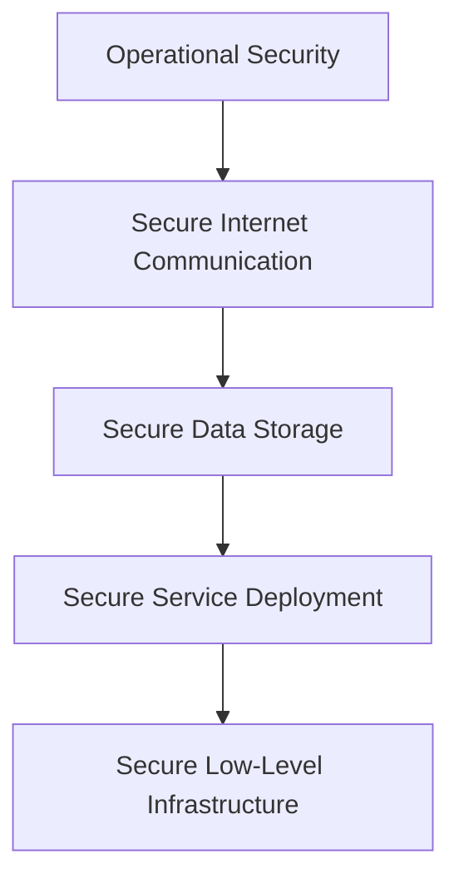
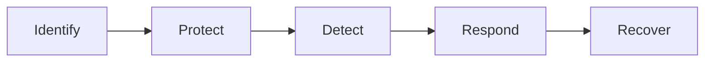
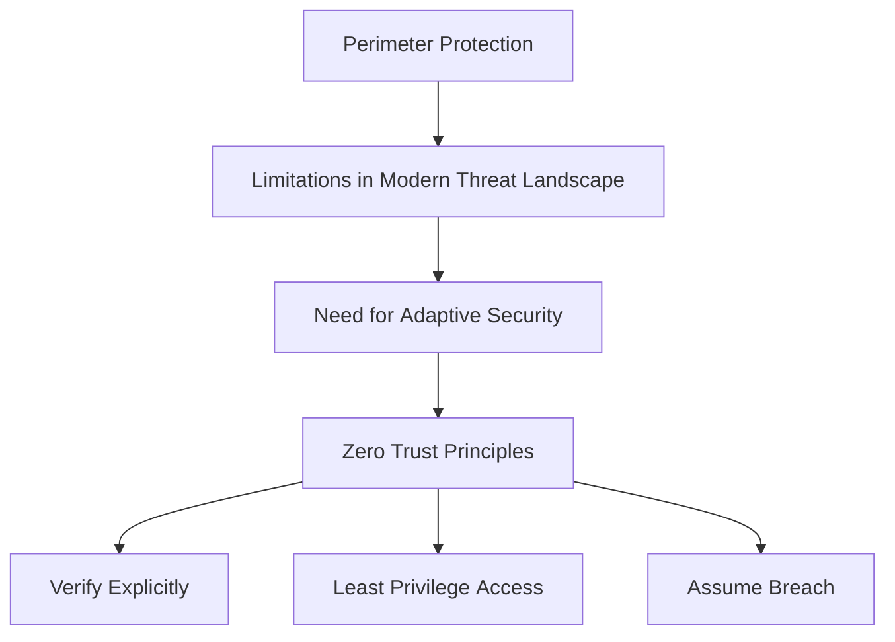

# Google Cloud Security Architecture Overview

> [!summary] Google Cloud Architecture  
> Google’s cloud infrastructure is built on a [[Multi-Layered Security]] model, designed to protect data from physical to application level.

## 🔐 Security Architecture Overview
### 1. 🏗️ Secure Low-Level Infrastructure

- **Physical Security**
  - Camera surveillance
  - Metal detectors
  - Biometric identification
- **Hardware Identity**
  - Servers have unique IDs for authentication
- **Operational Automation**
  - Automated updates
  - Issue detection mechanisms

---

### 2. 🛡️ Secure Service Deployment

- **Zero-Trust Security Model**
  - All users, devices, and systems require authentication and authorization
- **Customer Data Isolation**
  - Ensures tenant separation in shared infrastructure

---

### 3. 🔐 Secure Data Storage

- **Encryption at Rest**
  - Protects against unauthorized access
- **Scheduled Data Deletion**
  - Prevents both accidental and malicious loss

---

### 4. 🌐 Secure Internet Communication

- **Private IP Addressing**
  - Infrastructure isolated from public internet
- **Credential-Based Access**
  - Authentication required for accessing cloud services

---

### 5. ⚙️ Operational Security

- **Code and Software Security**
  - Verified code libraries
  - Manual code security reviews
- **Device and Credential Protection**
  - Safeguarding employee hardware
  - Multi-factor authentication (MFA)
- **Threat Detection & Patching**
  - Active monitoring
  - Regular security updates and patch management

[[Security in the cloud (5 Layers).canvas|Security in the cloud (5 Layers)]]

---
## Sovereign Clouds

> [!definition]
> **Sovereign Cloud**  
> A cloud setup confined to a specific country or region, ensuring data handling complies with local privacy laws.

## Key Points

- Ensures national laws govern data access and processing.
- Supports national security by keeping sensitive data (e.g., healthcare) local.
- Enables digital sovereignty for governments.
- Adds cost and complexity for global organizations.

> [!warning]
> Non-compliance may result in being barred from operating in that region.

---

# 🔐 HMAC-Based Authentication in Cloud APIs

> HMAC-based (or signature-based) authentication is widely used in cloud services like **AWS S3**, **Google Cloud Storage**, and others.

## 📌 Key Concepts

- The **servers and clients do not store the password (secret key) in plaintext**.
- Instead, they uses the **secret key to generate a cryptographic signature** (e.g., `HMAC-SHA256`) over the request.
- This **signature is sent along with authentication request**.
- The **other end verifies the signature** using the known secret key.

> [!note]  
> The secret key is never sent over the network, but it must be accessible to the client to generate the signature.

---

## 🔄 Why the Secret Key Must Be Stored on the Client

> [!warning] 
> You can't just store a hash of the secret key!

- Hashes like `SHA256` are **one-way** — they cannot be reversed.
- To compute an HMAC, you need the **original secret key**, not its hash.
- Therefore, the client must **store the secret key securely**, even if not in plaintext.

---

## ✅ Secure Storage Options for Secret Keys

| Method              | Description                                                                         |
| ------------------- | ----------------------------------------------------------------------------------- |
| **Secrets Manager** | Centralized service (e.g., Lockboxes) for managing and rotating secrets.            |
| **TPM / HSM**       | Hardware-based secure storage (Trusted Platform Module / Hardware Security Module). |
| **Encrypted Files** | Encrypted configuration files (e.g., `ComponentCredentials.xml`).                   |

---

## ❓ When Is the System Passphrase Used?

> [!info] 
> The system passphrase plays a critical role in Servers components.

Acts as a **primary key** for:
- File system encryption
- Cloud access
- Certificate management
- Boost tokens
- System configuration in scale-out environments
- Licensing information

# 🧑‍🚒 Defense In Depth ([[NIST CSF 2.0|NIST CSF]])

### **Layered approach that uses multiple security control**

* Identity Control: Measure that authenticates user before resource access (MFA)
* Protective Control: Protect access to resources and shields against malicious (AV, WAF, IaaC Policies)
* Network Controls: Firewalls, IPS  %% ------ > Not in NIST CSF Framework %%
* Detective Controls: IDS, Cloud Security Command Center
* Responsive Controls: Actions after detection
* Recovery Controls: Actions after damage, like reverting to backups, 

---

## 🪪 [[Identity & Access Management (IAM)|IAM]] and Cloud IAM
* Roles: Collection of permissions, policies and constrains to principals
* Principals: Users or Apps (Service Accounts) // Groups: Combine them depending on Org.
* Policies: Rules that allow/deny access.

### **Federation**
Granting external identities access to your cloud environment. Like using SSO.
It is recommended to allow MFA to users using federation.

## 🧱 Firewall best practices 
Here are a few best practices you can apply when using firewalls: 
* Always use the principle of least privilege. When creating firewall rules, only allow necessary traffic to traverse the network. 
* Use hierarchical firewall policies, which will allow your organization to apply firewall policies to the organization and folder levels. Invoking hierarchical policy structure promotes consistency across organizational resources and the firewalls that protect them. 
* If your organization isn’t using their CSP’s firewall service, choose a FWaaS solution developed by a company that tailors their product to the specific CSP’s environment. There are many companies that provide FWaaS solutions to organizations.

---
## 🛡️ What is **Software Delivery Shield (SDS)**?

SDS is like a **security team + smart kitchen + camera system** built by Google Cloud to protect the software supply chain.

### SDS includes:

- ✅ **Secure workstations**: developers work in the cloud, not risky personal laptops
- 📜 **SBOMs (Software Bill of Materials)**: a list of everything used in your software — like a food label!
- 🔍 **Assured Open Source Software (OSS)**: only uses open-source tools that are verified and safe
- 🚦 **Dashboards**: show you if something’s wrong with your app’s security

---

## 🕒 What does **Shift Left** mean?

Usually, security is added at the **end**, like putting the lock on the pizza box after delivery.

But **shifting left** means putting **security at the beginning**:

- While you’re mixing ingredients
- While the chef is cooking
- While the kitchen is open

This helps catch problems **early** and fix them **faster**.

> [!summary] In short:
> The **software supply chain** is everything involved in making software.  
> **Software Delivery Shield** helps keep that process safe from start to finish — like a super clean, secure pizza kitchen in the cloud.

---
# Google Cloud NIST CSF Alignment

> [!info]  
> This note aligns cloud tools with the five pillars of the **NIST Cybersecurity Framework (CSF)**: Identify, Protect, Detect, Respond, and Recover.

## 🧱 NIST CSF Pillars Overview

---

## 🕵️ Identify

|Tool|Description|
|---|---|
|IAM|Role-based access control; bind roles to groups for easier management.|
|Cloud Asset Inventory|35-day time-series inventory of GCP assets.|
|Cloud Identity|Centralized user/group management via IDaaS.|
|SCC (Identify)|Asset discovery, inventory, and vulnerability scans.|

> [!tip]  
> Use Cloud Asset Inventory with IAM to track access and ensure least-privilege access.

---

## 🛡️ Protect

|Tool|Purpose|
|---|---|
|Cloud IDS|Detects network-level intrusions and threats.|
|reCAPTCHA Enterprise|Prevents bots using adaptive challenges.|
|Cloud Armor|Defends against DDoS and web application attacks.|
|BeyondCorp Enterprise|Enforces contextual security policies.|
|Identity-Aware Proxy|Implements app-level access control.|
|Two-Factor Auth (2FA)|Adds hardware/software-based secondary authentication.|
|Service Controls|Prevents data exfiltration within GCP.|
|Zero Trust|Validates all access, regardless of origin.|
|SCC (Protect module)|Detects threats and enforces security posture.|

> [!warning]  
> Adopt a zero-trust model — assume breach and continuously validate access.

---

## 🔍 Detect

|Tool|Functionality|
|---|---|
|Cloud Logging|Real-time log collection and alerting.|
|Cloud Monitoring|Observability and alerting for multicloud/hybrid environments.|
|SCC (Detect module)|Consolidates threat detection and custom rule definitions.|
|Chronicle SIEM|Aggregates and analyzes security events in real-time.|

> [!example]  
> Use Cloud Logging to alert when service accounts are accessed outside business hours.

---

## 🧯 Respond

|Tool|Role in Incident Response|
|---|---|
|Chronicle SOAR|Automates and orchestrates threat response workflows.|
|Mandiant|Provides forensic analysis, breach investigation, and remediation.|

> [!tip]  
> Combine Chronicle SIEM with SOAR to automate detection-to-response pipelines.

---

## 🔄 Recover

|Tool|Capability|
|---|---|
|Backup & Restore|Manages incremental backups across all workloads.|
|Actifio Go|Supports granular, app-aware, and bare-metal recovery.|
|Cyber Insurance|Covers financial and legal aspects of recovery from breaches.|

> [!note]  
> Test recovery processes regularly to ensure backup integrity and response readiness.

> [!summary] Key Takeaways
> 
> - Use the NIST CSF to guide tool adoption and security maturity.
> - Map tools like SCC and Chronicle across multiple pillars.
> - Implement layered defenses, automate responses, and maintain tested recovery plans.

---
# Perimeter Protection and Zero Trust

## Perimeter Protection
- Identity and Context based access
- Firewalls
- IDPS (Intrusion Detection and Prevention Systems)
- VPNs Virtual Private Networks
- ACLs Access Control Lists
- DMZs

## 🔒 Firewall Rules Logs & VPC Flow Logs

Google Cloud's **Cloud Logging** collects logs from resources for analysis via **Logs Explorer**.  
Two key log types:

---
### 🚧 Firewall Rules Logs

- **Purpose**: Track actions of firewall rules (allow/deny traffic).
- **Use Case**: Verify if a rule blocks traffic from a specific IP range.
- **Details Logged**:
  - Source & destination IPs
  - Protocols & ports
  - Date & time
- **Access**: Available in Cloud Logging when logging is enabled.

---
### 🌐 VPC Flow Logs

- **Purpose**: Monitor network traffic in/out of VMs in a VPC.
- **Use Case**: Analyze traffic patterns, detect threats, troubleshoot connectivity.
- **Details Logged**:
  - Source & destination IPs
  - Ports & protocols
  - Timestamps

---

## Zero Trust
- Verify Explicitly: every access request must be authenticated and authorized before access is granted to any resource.
- Least Privilege Access: users, devices, and systems should only be granted the minimum access necessary to perform their tasks.
- Assume Breach: Organizations embracing zero trust should operate under the assumption that a breach has already happened or will happen, and design their security measures accordingly.

### Justification

### Implementing Zero Trust
- IAM: Identity and Access Management
- MFA: Multi-Factor Authentication
- Micro Segmentation: Divides a network into smaller, isolated segments to limit unauthorized access and reduce the potential attack surface.
- Network Access Control (NAC): Policy Based Access Control enforces policy-based access control to network resources.

---
## Context Aware Access Location
- CASBs (Cloud Access Security Brokers): Act as intermediaries between cloud service users and cloud service providers, enabling organizations to enforce security policies and maintain visibility over cloud-based activities.
- SASE Platforms: combine network and security functions into a single, cloud-based service.

---
## Comparison of Traditional Perimeter Security Measures and Zero Trust Measures

| Characteristic   | Traditional Perimeter Security Measures                                                                                           | Zero Trust Measures                                                                                                                                                                                                                         |
| ---------------- | --------------------------------------------------------------------------------------------------------------------------------- | ------------------------------------------------------------------------------------------------------------------------------------------------------------------------------------------------------------------------------------------- |
| Focus            | Creates a strong barrier between the internal network and the outside world                                                       | Verifies access to resources on a case-by-case basis, regardless of location                                                                                                                                                                |
| Key Technologies | Firewalls, IDS, IPS, Physical security controls                                                                                   | Identity and access management (IAM), Multi-Factor Authentication (MFA), Micro-segmentation, Network Access Control (NAC), Continuous monitoring with Cloud Access Security Brokers (CASBs) and Secure Access Service Edge (SASE) platforms |
| Benefits         | Can be relatively simple to implement and manage                                                                                  | Can provide more comprehensive security and visibility for a large number of users than traditional perimeter security measures                                                                                                             |
| Drawbacks        | Can be difficult to protect against sophisticated attacks, Provide limited protection once an attacker is in the internal network | Can be more complex to implement and manage than traditional perimeter security measures                                                                                                                                                    |

---
## 📚 Resources

- [NIST Cybersecurity Framework](https://www.nist.gov/cyberframework)
- [Google Cloud Security](https://cloud.google.com/security)

---
Penguinified by [https://chatgpt.com/g/g-683f4d44a4b881919df0a7714238daae-penguinify](https://chatgpt.com/g/g-683f4d44a4b881919df0a7714238daae-penguinify)
