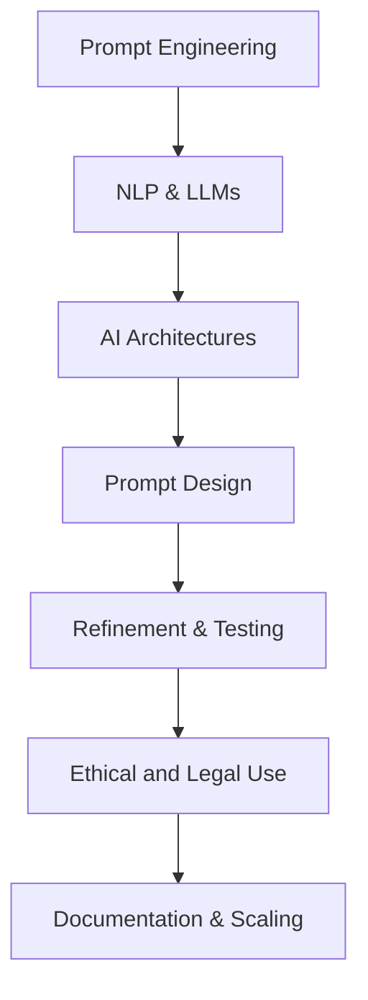
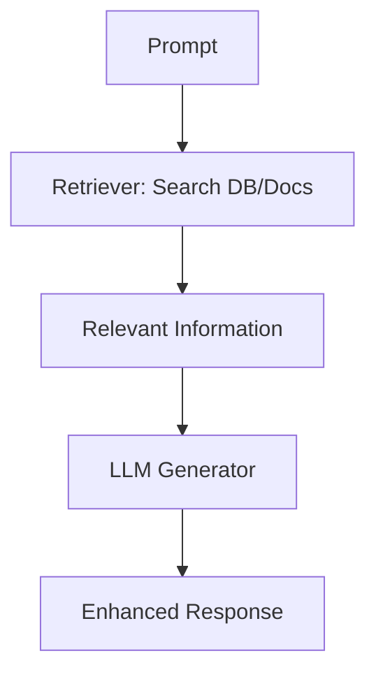
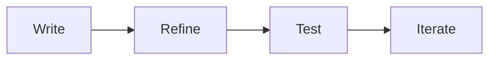
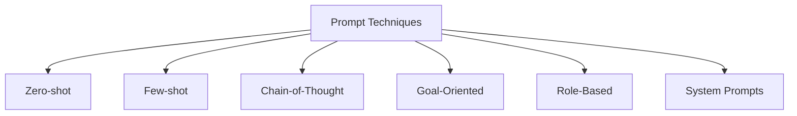
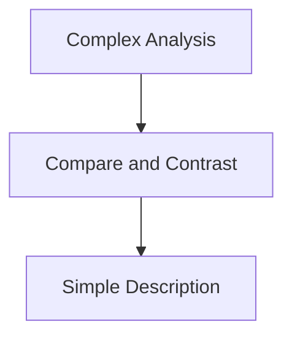
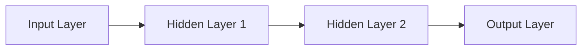
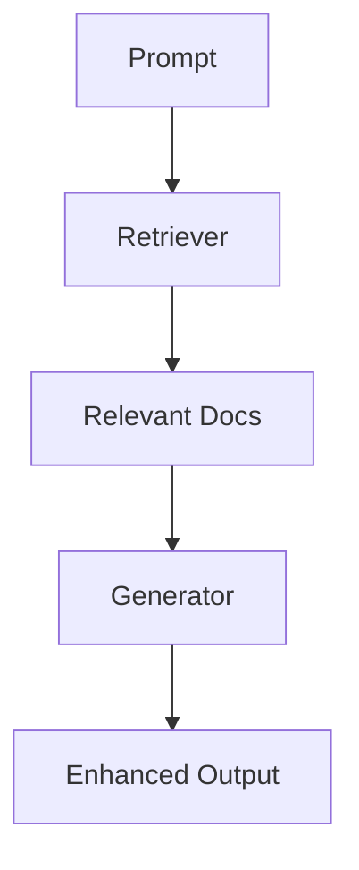
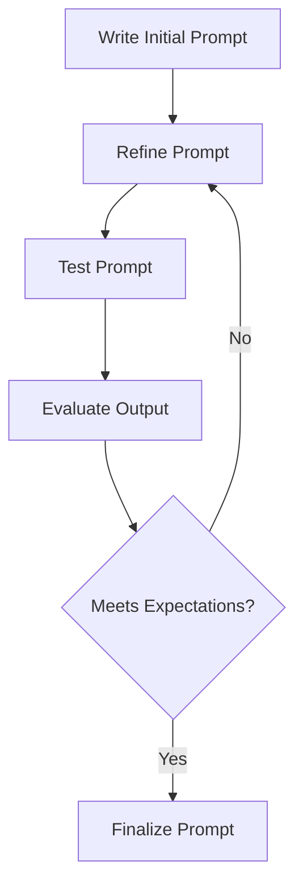
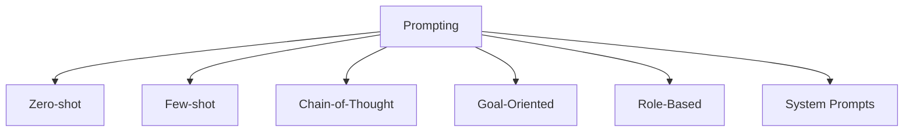
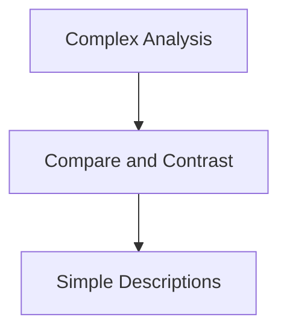

# Introduction to Prompt Engineering

Prompt Engineering is the art and science of crafting inputs to AI tools to elicit high-quality, relevant, and contextually appropriate outputs. Prompts shape AI behavior and determine the usefulness of its responses.

---

## 📘 Learning Objectives

By the end of this course, you will be able to:
- Understand the fundamentals of NLP and LLMs.
- Gather stakeholder requirements for prompt design.
- Structure and format prompts effectively.
- Optimize prompt techniques for better AI responses.
- Address ethical, legal, and technical considerations.
- Communicate clearly when designing AI interactions.
    



---

## 🧠 Natural Language Processing (NLP) and LLMs

NLP enables machines to understand, interpret, and generate human language. Large Language Models (LLMs) like GPT use this capability to perform tasks such as:

- Translation
- Summarization
- Content generation
    

### LLM Capabilities

| Task Type         | Examples                                  |
|------------------|-------------------------------------------|
| Translation       | English to Spanish                        |
| Content Creation  | Blog posts, product descriptions          |
| Summarization     | Research papers, articles                 |

---

## 🔧 AI Architectures: What Powers the AI?

### Neural Network Overview


### Components

- **Weights & Biases:** Control influence of inputs
- **Activation Functions:** Introduce non-linearity
- **Layer Types:** ANN, RNN, CNN, Transformers
    

### Comparison of Architectures

| Feature      | ANN         | RNN             | CNN                   | Transformer          |
| ------------ | ----------- | --------------- | --------------------- | -------------------- |
| Use Case     | General     | Sequential Data | Images & Spatial Data | Language/Text        |
| Key Strength | Simplicity  | Memory          | Feature Detection     | Contextual Awareness |
| Mechanism    | Feedforward | Feedback Loops  | Convolutions          | Self-Attention       |
|              |             |                 |                       |                      |


---

## 🧩 Enhancing Model Performance

### Retrieval-Augmented Generation (RAG)



---

## ✍️ Prompt Fundamentals

### Prompt Lifecycle



### Prompt Structure

| Element       | Description                            |
| ------------- | -------------------------------------- |
| Objective     | What you want the AI to achieve        |
| Context       | Background needed for relevance        |
| Input Data    | Any files or text referenced           |
| Constraints   | Length, tone, output type              |
| Output Format | Bullet points, paragraphs, code blocks |


---

## 🛠️ Prompt Techniques

### Prompt Typology



---

## 🧠 Writing for Audience and Complexity

### Prompt Complexity Pyramid



### Audience Examples

| Audience         | Prompt Type Example                           |
| ---------------- | --------------------------------------------- |
| Small Businesses | Write product email under 200 words, with CTA |
| College Students | Social media post about new app               |


---

## ❌ Common Prompt Pitfalls

| Pitfall             | Fix                                                       |
|---------------------|------------------------------------------------------------|
| Ambiguity           | Be specific: Who, what, when, where                       |
| Overloading         | Split into multiple prompts                               |
| Bias                | Ask neutral, open-ended questions                         |
| Complexity          | Tailor to audience level                                  |
| Lack of Context     | Include background, title, or source                      |


---

## ⚖️ Legal and Ethical Prompt Design

### Ethics Checklist


- Use gender-neutral language
- Avoid stereotypes
- Include diverse perspectives
- Provide context
- Conduct audits

### Copyright & Privacy Warning

```ad-note
Avoid prompts that:
- Generate text/images close to copyrighted material
- Include personal or sensitive data
- Accept terms on behalf of users
```

---

## 🧾 Metadata and Prompt Templates

### Template Sample


Template Name: Content Summary
Purpose: Summarize articles or reports
Input: Long-form content
Output: Executive summary (under 150 words)
LLM Instructions: Maintain key points and neutral tone

```ad-note
Template Name: Sentiment Analysis - Movie Reviews
Purpose: Classify reviews as Positive, Negative, or Neutral
Input: Movie Review Text
Output: Sentiment classification
LLM Instructions: Identify and explain tone
Examples:
- "I loved the movie" → Positive
- "It was okay" → Neutral
- "Terrible experience" → Negative
```


#### 🧠 AI Essentials: A Guide to Prompt Engineering and Generative AI

> A concise guide to designing better prompts, understanding NLP, leveraging LLMs, and applying ethical AI practices.

---

### 🎯 What You’ll Learn

- How NLP and LLMs process and generate language.
- Techniques to gather and apply stakeholder requirements.
- Structuring prompts for clarity, relevance, and depth.
- Using architectures like Transformers and RAG.
- Avoiding bias and maintaining ethical standards.
- Communicating and documenting prompt design effectively.
    

---

### 💬 NLP and LLMs: The Foundation of AI Responses

**Natural Language Processing (NLP)** allows AI to understand and generate human language.  
**Large Language Models (LLMs)** like GPT use NLP to complete tasks such as:

|Task|Example Use Cases|
|---|---|
|Translation|English to Spanish|
|Summarization|Research paper synopsis|
|Content Gen.|Blog posts, ads, scripts|

---

### 🏗️ AI Architectures in Action

AI is built on neural network models inspired by the brain. Here's a breakdown:





|Architecture|Use Case|Strength|
|---|---|---|
|ANN|General tasks|Simplicity|
|RNN|Sequential data|Memory|
|CNN|Visual data|Feature detection|
|Transformer|Language & context|Parallel processing|

> 💡 Transformers enable models like GPT to understand full sentence context efficiently.

---

### 📦 Enhancing LLMs with RAG

RAG = Retrieval-Augmented Generation



It boosts LLM accuracy by fetching external info in real-time.

---
# 🔄 The Prompt Engineering Process

This document outlines the **core workflow** for designing, refining, and evaluating prompts in Generative AI. Each step is critical for producing high-quality, aligned outputs from language models (LLMs).
### ✍️ Designing Prompts that Deliver


## ✍️ Step 1: Write the Initial Prompt

Begin with clear, structured instructions to guide the AI’s behavior.

### ✅ Components of a Good Initial Prompt

|Component|Description|Example|
|---|---|---|
|**Objective**|Define the task in simple terms|"Generate an email template for a product launch."|
|**Context**|Provide background for relevance|"Write a launch email for a new AI writing tool targeting freelance writers."|
|**Input Data**|Mention any specific data the model should use|None needed|
|**Constraints**|Add rules like word count, tone, or style|"Keep under 200 words. Use a casual yet professional tone."|
|**Output Format**|Specify layout: list, paragraph, table, Q&A, etc.|"Write in bullet points with a CTA at the end."|

> 🧠 Tip: Use consistent formatting and be explicit—AI needs structure.

---

## 🔧 Step 2: Refine the Prompt

If the output is not satisfactory, adjust your prompt based on what didn’t work.

### 🔍 Refinement Checklist

- Add or tighten constraints (word count, format, tone)
    
- Provide 1–2 examples of desired output
    
- Clarify vague terms or ambiguous objectives
    
- Specify the expected level of detail
    

### ✨ Example: Refined Prompt

```markdown
"Craft a launch email for an exciting new AI writing tool designed for freelance writers. Keep the email under 200 words. Use a friendly yet professional tone. Output Format: Bullet points with a compelling call-to-action (CTA) at the end. Add a personal touch: Include a brief anecdote or message to connect with the reader."
```

> [!tip] Remidner
> 🪄 *Small edits in phrasing or tone can have a big impact on results.*


---

## 🧪 Step 3: Test the Prompt

Run your prompt through the LLM and evaluate the response. Use the following criteria:

|Evaluation Metric|What to Look For|
|---|---|
|**Accuracy**|Is the information factually correct?|
|**Relevance**|Does it directly address the prompt goal?|
|**Response Time**|Is the output timely and usable in the context (e.g., app latency)?|
|**Satisfaction**|Do test users or stakeholders approve of the result?|
|**Efficiency**|Is the output resource-efficient or wasteful (e.g., excessive token use)?|
|**Consistency**|Do similar prompts yield similar quality results?|

> [!tip] Testing Strategy  
> 🛠️ Run multiple tests with small variations to gather patterns and edge cases.

---

## 🔁 Step 4: Iterate Until It Works

Keep refining based on feedback and metrics until your prompt performs as expected.

### 🔄 Iteration Tips

- **Document Changes**: Keep a version history of prompts and results.
- **Compare Outputs**: Side-by-side comparisons highlight progress.
- **Involve Stakeholders**: Feedback from target users ensures alignment.
    

### 🚦 When to Stop Iterating

- ✅ Stakeholders provide **positive feedback**.
- ✅ Outputs meet **defined objectives**.
- ⚠️ Further edits offer **diminishing returns**.
    

---

### 🔂 Summary Diagram



---

This process can be repeated and adapted for various industries, languages, and LLMs.

For team-wide usage, consider documenting each version and embedding it into your prompt library or template system.

> [!tip] Tip
> 💡 "Prompt Engineering isn’t just about asking better questions—it’s about designing better conversations."

---

### 🔧 Prompting Strategies



- **Zero-shot**: No examples needed.
- **Few-shot**: Provide example outputs.
- **CoT**: Step-by-step reasoning.
- **Role-based**: “Act as a…”
- **System Prompt**: Set global behavior.
    

---

### 🧠 Matching Prompt to Audience



|Audience|Sample Prompt|
|---|---|
|Small Business|"Write a product intro email under 200 words."|
|College Student|"Create a social media post promoting a study app."|

---

### 🧱 Common Pitfalls (And Fixes)

|Pitfall|Solution|
|---|---|
|Ambiguity|Be specific: who, what, where|
|Overload|Break into smaller tasks|
|Bias|Use neutral phrasing|
|Vague Output|Add constraints or examples|
|Context Loss|Include clear background|

---

### ⚖️ Ethics & Legal Design

**Checklist:**

- ✅ Gender-neutral and stereotype-free language
- ✅ Avoid copying copyrighted content
- ✅ Include proper attribution and privacy safeguards
- ✅ Comply with GDPR or local laws
- ✅ Regularly audit output
    

```ad-note
⚠️ Avoid prompts that:
- Mimic copyrighted works
- Include personal data
- Accept legal terms unknowingly
```

---

### 📋 Templates and Metadata

```ad-note
Template Name: Sentiment Analysis - Movie Reviews
Purpose: Classify reviews as Positive, Negative, or Neutral
Input: Movie Review Text
Output: Sentiment classification
LLM Instructions: Identify and explain tone
Examples:
- "I loved the movie" → Positive
- "It was okay" → Neutral
- "Terrible experience" → Negative
```


Prompt templates improve clarity, consistency, and reusability across teams.

---

### 🧰 Tools & Formats

|Tool|Use Case|
|---|---|
|Markdown|Dev-friendly format for prompts|
|GitHub|Version control|
|PromptLayer|Evaluate prompt variants|
|Jupyter|Code + output + doc in one file|
|Notion|Team collaboration|
|Asana/Jira|Track prompt lifecycle|

---

### ✅ Best Practices Recap

- Use structured instructions and examples
- Add context and constraints
- Choose the right model and prompting method
- Document your prompts
- Test, iterate, and refine continuously
    

---

### 📌 Final Tip

> [!quote] ✨ Final Tip
> **“A good prompt is like a good question—it gets the right conversation started.”**


---

### 🔗 Resources

- [OpenAI Cookbook](https://github.com/openai/openai-cookbook)
- [Prompt Engineering Guide (dair-ai)](https://github.com/dair-ai/Prompt-Engineering-Guide)
    